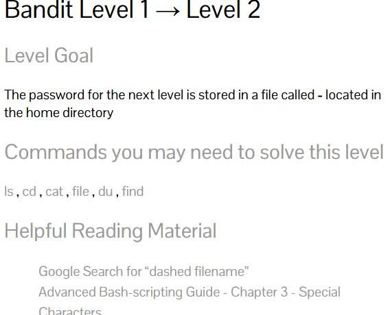
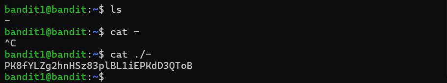
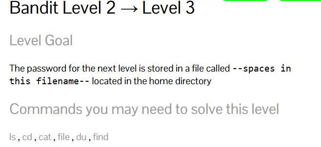
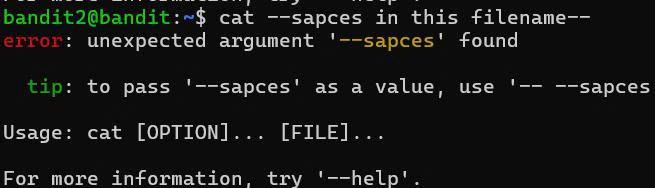

# overthewire-solutions
Overthewire - writeups CTF
- **challenge**: bandit overthewire level 1->34
- **category**: basic linux
- **Difficulty**: easy
- **source** : [bandit overthewire](https://overthewire.org/wargames/bandit/)

**Note**: Đây là ```write up``` đầu tiên của mình trên hành trình ```ctf``` đặc biệt là ```puwable```. Trong bài viết này mình sẽ chia sẽ về con đường chinh phục 34 level của ```command linux``` trên ```bandit overthewire```.Các game của bandit là các thử thách cơ bản về các câu lệnh basic  linux giúp chúng ta có một cái nhìn khách quan về ```CTF```. Vì đây là bài viết đầu tiên của mình nên có gì sai sót mong mọi người góp ý.  

## level 0
Ở level 0 đề yêu cầu mình sữu dụng ```SSH``` .Máy chủ mà mình phải kết nối là ```bandit.labs.overthewire.org```, trên cổng ```2220``` .Tên đăng nhập và mật khẩu là ```bandit0```.


#### Solution
Để kết nối vào sever với cổng 2220, ta cần thêm option ```-p 2220``` (-p nghĩa là port) , ngoài ra ở cuối câu lệnh ta có thể sữ dụng thêm  option ```-l bandit0``` (-l nghĩa là login)


Lệnh input terminal: ```SSH bandit.labs.overthewire.org -p 2220 -l bandit0``` 
                                    hoặc  
                      ``` SSH bandit0@bandit.labs.overthewire.org -p2220```


Sau khi nhập input thì màn hình sẽ hiện ra yêu cầu nhập password và khi đó ta cần nhập mật khẩu  ```bandit0``` là sẽ vào được sever.


#### References
- [Secure shell(SSH) on wikipedia](https://en.wikipedia.org/wiki/Secure_Shell).
- [How to use SSH with a non-standard port on It's FOSS](https://itsfoss.com/ssh-to-port/).
- [How to use SSH with ssh-keys on wikiHow](https://www.wikihow.com/Use-SSH)

#### Level 0->1
Ở ```level 0->1 ``` mình cần tìm password trong thư mục tên là ```readme``` nằm trong thư mục chính. Sử dụng mật khẩu mới lấy được để đăng nhập vào ```bandit1``` bằng ```SSH```. Bất cứ khi nào bạn lấy được mật khẩu cho một cấp độ, sử dụng ```SSH``` trên ```port 2220``` để đăng nhập và tiếp tục game.

 

#### Solution
Trước khi giải game này ta phải làm quen với một số lệnh cơ bản:
- ```ls```:cho biết có bao nhiêu file trong folder.
- ```cd ```:lệnh này đưa mình đến một folder cụ thể.
- ```cat```:lệnh này cho phép mình đọc nội dung trong thư mục.
- ```file```:lệnh này dùng để xem kiểu file.
- ```du``` :lệnh này dùng để xem dung lượng của file và folder.
- ```find```:lệnh này dùng để tìm một file hay một folder.

Với các lệnh ở trên, ta sủ dụng lệnh ```ls``` để xem có bao nhiêu thư mục thì bất ngờ thư mục``` readme ``` hiện ra màn hình. Đến đây thì ta chỉ cần sử dụng lệnh ```cat``` để đọc thư mục ```readme```, và mật khẩu của level này hiện trong thư mục readme là :  ```6y2kwnwK6grgvwvpvLaa2T1cpFEKOhNR mk1 ```.

#### Level 1->2
Ở ```level 1->2 ``` mình cần tim password ở trong một thư mục có tên là ```-``` được lưu trữ trong thư mục chính.



#### Solution 
Ở ```level 1->2```.Mình dùng lệnh ```cat``` để đọc thư muc ```-``` trong ```home directory```.Nhưng vấn đề đặt ra là tên thư mục là một dạng ``` dash filename ```, nên nếu ta dùng lệnh cat thông thường ```cat -``` thì nó sẽ hiểu một cách đăt biệt là đọc dữ liệu từ bàn phím ``` stdin ```.vậy để đọc được thư mục ```-``` bằng lệnh ```cat``` ta cần thêm vào địa chỉ của thư mục bằng cách thêm lệnh ``` ./ ```.Cụ thể ``` ./- ```


#### references
- [Google search for "dash filename".](https://www.google.com/search?q=dashed+filename).
- [Advanced Bash-ripting-chapter 3-Specical characters.  ](https://linux.die.net/abs-guide/special-chars.html)

##### Level 2->3
Ở ```level 2->3``` mình cần tìm password được lưu trữ trong một thư mục ```--spaces in this filename--``` được lưu trữ  ở thư mục chính.



#### Solution
Như ở ```level``` trước nếu  thấy tên của một thư mục bắt đầu bằng ```-``` thì đó là một ```dash filename```.Do đó mình không thể nào dùng lệnh ```cat``` để đoc file ```--spaces in this filename--```, khi đó nó sẽ hiểu là một tùy chọn (-option) và màn hình sẽ hiển thị ra lỗi ```unexpected argument '--spaces' found``` nghĩa là lỗi tìm thấy đối số không mong muốn.


Để khắc phục lỗi như trên ta phải dùng một lệnh ```option``` đằng trước ```filename```.Cụ thể ```cat./"--spaces in this filename--"```


Ngoài ra vẫn còn thêm một hướng tiếp cận khác để đọc file ```--spaces in this filename--``` bằng cách thêm đường dẫn cụ thể ```\```.Cụ thể ```./--spaces\ in\ this\ filename--```

 
