# overthewire-solutions
Overthewire - writeups CTF
- **challenge**: bandit overthewire level 1->34
- **category**: basic linux
- **Difficulty**: easy
- **source** : [bandit overthewire](https://overthewire.org/wargames/bandit/)

**Note**: Đây là ```write up``` đầu tiên của mình trên hành trình ```ctf``` đặc biệt là ```puwable```. Trong bài viết này mình sẽ chia sẽ về con đường chinh phục 34 level của ```command linux``` trên ```bandit overthewire```.Các game của bandit là các thử thách cơ bản về các câu lệnh basic  linux giúp chúng ta có một cái nhìn khách quan về ```CTF```. Vì đây là bài viết đầu tiên của mình nên có gì sai sót mong mọi người góp ý.  

## level 0
Ở level 0 đề yêu cầu mình sữu dụng ```SSH``` .Máy chủ mà mình phải kết nối là ```bandit.labs.overthewire.org```, trên cổng ```2220``` .Tên đăng nhập và mật khẩu là ```bandit0```.


#### Solution
Để kết nối vào sever với cổng 2220, ta cần thêm option ```-p 2220``` (-p nghĩa là port) , ngoài ra ở cuối câu lệnh ta có thể sữ dụng thêm  option ```-l bandit0``` (-l nghĩa là login)


Lệnh input terminal: ```SSH bandit.labs.overthewire.org -p 2220 -l bandit0``` 
                                    hoặc  
                      ``` SSH bandit0@bandit.labs.overthewire.org -p2220```


Sau khi nhập input thì màn hình sẽ hiện ra yêu cầu nhập password và khi đó ta cần nhập mật khẩu  ```bandit0``` là sẽ vào được sever.


#### References
- [Secure shell(SSH) on wikipedia](https://en.wikipedia.org/wiki/Secure_Shell).
- [How to use SSH with a non-standard port on It's FOSS](https://itsfoss.com/ssh-to-port/).
- [How to use SSH with ssh-keys on wikiHow](https://www.wikihow.com/Use-SSH)

#### Level 0->1
Ở ```level 0->1 ``` mình cần tìm password trong thư mục tên là ```readme``` nằm trong thư mục chính. Sử dụng mật khẩu mới lấy được để đăng nhập vào ```bandit1``` bằng ```SSH```. Bất cứ khi nào bạn lấy được mật khẩu cho một cấp độ, sử dụng ```SSH``` trên ```port 2220``` để đăng nhập và tiếp tục game.

 

#### Solution
Trước khi giải game này ta phải làm quen với một số lệnh cơ bản:
- ```ls```:cho biết có bao nhiêu file trong folder.
- ```cd ```:lệnh này đưa mình đến một folder cụ thể.
- ```cat```:lệnh này cho phép mình đọc nội dung trong thư mục.
- ```file```:lệnh này dùng để xem kiểu file.
- ```du``` :lệnh này dùng để xem dung lượng của file và folder.
- ```find```:lệnh này dùng để tìm một file hay một folder.

Với các lệnh ở trên, ta sủ dụng lệnh ```ls``` để xem có bao nhiêu thư mục thì bất ngờ thư mục``` readme ``` hiện ra màn hình. Đến đây thì ta chỉ cần sử dụng lệnh ```cat``` để đọc thư mục ```readme```, và mật khẩu của level này hiện trong thư mục readme là :  ```6y2kwnwK6grgvwvpvLaa2T1cpFEKOhNR mk1 ```.

#### Level 1->2
Ở ```level 1->2 ``` mình cần tim password ở trong một thư mục có tên là ```-``` được lưu trữ trong thư mục chính.


#### Solution 
Ở ```level 1->2```.Mình dùng lệnh ```cat``` để đọc thư muc ```-``` trong ```home directory```.Nhưng vấn đề đặt ra là tên thư mục là một dạng ``` dash filename ```, nên nếu ta dùng lệnh cat thông thường ```cat -``` thì nó sẽ hiểu một cách đăt biệt là đọc dữ liệu từ bàn phím ``` stdin ```.vậy để đọc được thư mục ```-``` bằng lệnh ```cat``` ta cần thêm vào địa chỉ của thư mục bằng cách thêm lệnh ``` ./ ```.Cụ thể ``` ./- ```


#### references
- [Google search for "dash filename".](https://www.google.com/search?q=dashed+filename).
- [Advanced Bash-ripting-chapter 3-Specical characters.  ](https://linux.die.net/abs-guide/special-chars.html)

##### Level 2->3
Ở ```level 2->3``` mình cần tìm password được lưu trữ trong một thư mục ```--spaces in this filename--``` được lưu trữ  ở thư mục chính.


#### Solution
Như ở ```level``` trước nếu  thấy tên của một thư mục bắt đầu bằng ```-``` thì đó là một ```dash filename```.Do đó mình không thể nào dùng lệnh ```cat``` để đoc file ```--spaces in this filename--```, khi đó nó sẽ hiểu là một tùy chọn (-option) và màn hình sẽ hiển thị ra lỗi ```unexpected argument '--spaces' found``` nghĩa là lỗi tìm thấy đối số không mong muốn.


Để khắc phục lỗi như trên ta phải dùng một lệnh ```option``` đằng trước ```filename```.Cụ thể ```cat./"--spaces in this filename--"```

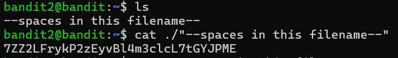

Ngoài ra vẫn còn thêm một hướng tiếp cận khác để đọc file ```--spaces in this filename--``` bằng cách thêm đường dẫn cụ thể ```\```.Cụ thể ```./--spaces\ in\ this\ filename--```

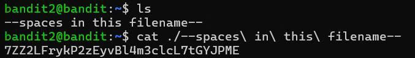

#### References
- [Google search for "spaces in filename"](https://www.google.com/search?q=spaces+in+filename).


#### Level 3 -> 4
Ở level này ```password``` nằm ở một ```file ẩn ``` trong thư mục ```inhere```.

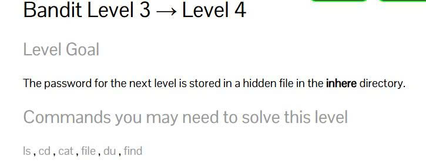

#### Solution 
Ở level này mình cần phải hiểu rằng ```inhere``` ở đây không phải là một file để ta có thể đọc bằng lệnh ```cat``` mà ```inhere``` là một thư mục chính (home directory). Vì thế nếu muốn lấy được mật khẩu ta cần phải di chuyển vào thư mục ```inhere``` bằng một lệnh quen thuộc ```cd```.Cụ thể ```cd inhere```.


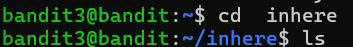


Nếu khi vào được thư mục ```inhere``` mà bạn vội vàng input lệnh ```ls``` thì xin chúc mừng bạn đã phạm sai lầm.Ở đây minh sẽ đăt ra một giả thuyết là thư mục nằm trong ```inhere``` có tên bắt đầu bằng ```.``` 
thì lệnh ```ls``` sẽ không thể nào  hiển thị ra được.

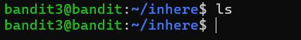

Nói về bản chất một tí. Lệnh ```ls``` chỉ liệt kê ra các lệnh mà tên không bắt đâu bằng ```.``` và khi xuất ra các file hay thư mục sẽ hiển thị theo bảng chữ cái. Khi này mình muốn đọc hết tất cả các file ẩn trong thư mục ```inhere``` ta sử dụng lệnh ```ls -la```.


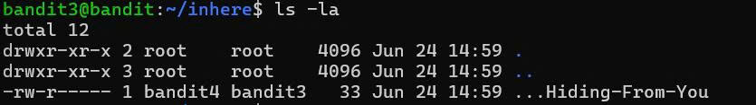

Đến đây ta đã thấy xuất hiện file ẩn ```...Hiding-From-You```. Và phần việc còn lại là dùng lệnh ```cat``` để đọc nội dung bên trong. Cụ thể ```cat ...Hiding-From-You```

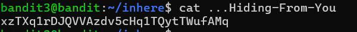
Mật khẩu cho level tiếp theo là: xzTXq1rDJQVVAzdv5cHq1TQytTWufAMq.


#### Level 4 -> 5
Level này yêu cầu mình lấy password được giấu trong ```file duy nhất  có thể đọc được``` được lưu trữ trong thư mục ```inhere```.

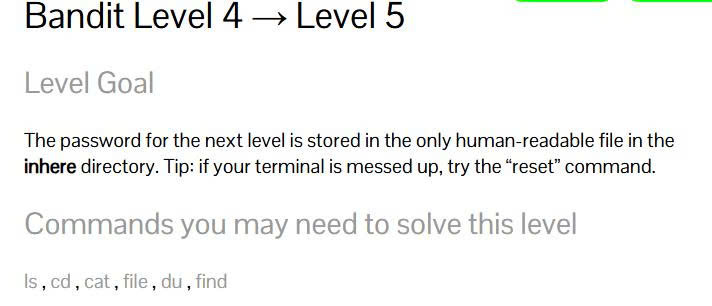

#### Solution
Như ở thử thách trước sau khi vào được ```user bandit4```, mình nhập lệnh ```ls``` để hiển thị các thư mục, thì thấy xuất hiện Folder ```inhere```. Dùng lệnh ```cd``` để đi vào thư mục ```inhere```, tiếp đến mình kiểm tra các thư mục con hay các file có trong thư mục này bằng lệnh ```ls```.Bất ngờ xuất hiện hàng loạt file nhỏ ```-file00->--file09```

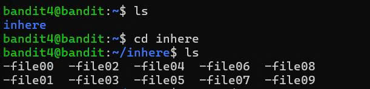

Đến đây mình sẽ cung cấp cho các bạn 3 hướng đi để có cái nhìn trực quan về cách đọc file như nào cho hiệu quả.

- Cách tiếp cận đầu tiên, ta có thể dùng lệnh ```cat``` cho từng file .Cụ thể ```cat ./-file00->09```.
- Cách tiếp cận thứ hai, ta có thể dùng lệnh ```file```.Cụ thể ```file ./*```.

  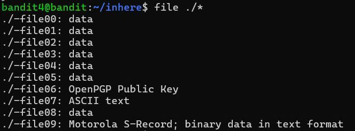

- Cách tiếp cận thứ ba, ta vẫn sẽ sử dụng lệnh ```file``` nhưng theo một cách tối ưu. Nếu dùng lệnh ```file``` như ở cách tiếp cận thứ hai thì bắt buộc mình phải đi vào thư mục ```inhere```. Vậy nếu không đi vào thư mục ```inhere``` thì có thể đọc được các file trong đó không? Thật vậy, mình chỉ cần thêm ```tên thư mục ```vào giữa ```./tên thư mục/*```.Cụ thể ```file ./inhere/*```.

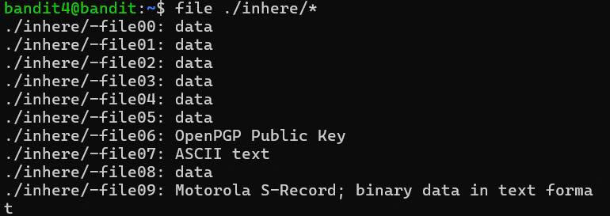

Đến đây ta có thể dễ dàng thấy được ```./inhere/-file07``` là nơi chứa password. Việc cuói cùng là dùng lệnh ```cat``` để đọc file. Cụ thể ```cat ./inhere/-file07```.

- Mật khẩu cho level tiếp theo là: 6C7h9GD8M6ai5nr7wo1RonrzFjj9yIrG.

#### Level 5-> 6
Đén ```level 5->6``` yêu cầu mình tìm password trong một ```file con``` nào đó trong thư mục ```inhere```. Đòng thời thỏa mãn các thuộc tính sau:

- Human-readable(có thể đọc được)
- 1033 bytes in size(có dung lượng là 1033 bytes)
- Not executable(không có khả năng thực thi)


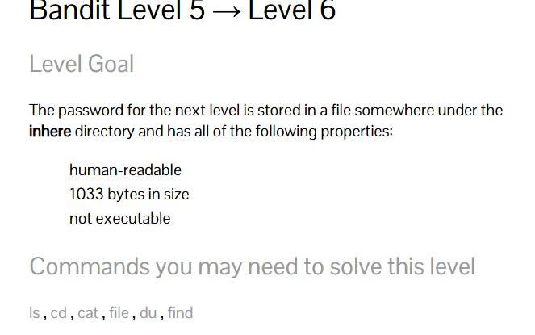


#### Solution


Ở level này nếu mình chỉ dùng lệnh ```ls``` để xem hiển thị các thư mục, file sau đó dùng lệnh ```cd``` đi vào các thư mục để tìm password thì sẽ rất lâu. Vì khi với đi vào thư mục ```inhere```, lệnh ```ls``` làm hiển thị thư mục ```maybehere00 -> maybehere19```, trong từng thư mục đó có thêm rất nhiều các ```file nhỏ``` khác nữa. Nên việc tìm mật khẩu bằng cách này là bất khả thi.

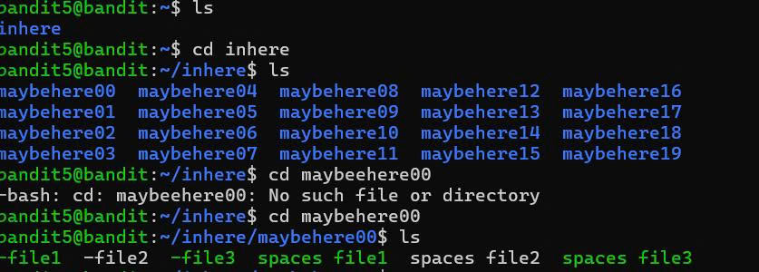

Dựa vào các điều kiện của đề. Mình sẽ suy nghĩ về việc sử dụng lệnh tối ưu hơn, có thể xem định dạng các file, tìm kiếm nhanh chóng:

- **Theo điều kiện đầu tiên**. ```File``` chứa password có thể đọc được (human-readable). Từ đó, mình sẽ sử dụng lệnh ```file``` kết hợp với lệnh ```grep``` để lọc lại các file mình có thể đọc theo```ASCII text```. Cụ thể ```file */* | grep "ASCII text"``` (```*/*``` trong lệnh input được xem là một ```option``` giúp kiểm tra các file trong thư mục con)

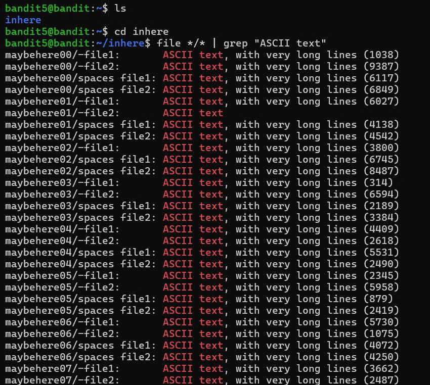


- **theo điều kiện thứ hai**. ```file``` chứa password có dung lượng là ```1033 bytes```. Mình dùng lệnh ```find ``` để tìm. Cụ thể ``` find . -type f -size 1033c```, ở đây chắc nhiều người sẽ không hiểu tại sao lại dùng ```.``` và ```-type ``` là cái gì?

--> Khi đã đi vào thư mục ```inhere``` ta sử dụng dấu ```.``` để tìm các file hay thư mục con nằm trong thư mục ```inhere```. Lệnh ```-type f``` nghĩa là mình yêu cầu nó chỉ tìm các ```file``` bỏ qua các ```folder``` khác. Còn ```-size 1033c``` nghĩa là dung lương 1033 bytes.


-**theo điều kiện cuối**. ```file``` chứa password không có khả năng thực thi nghĩa là một ```file``` mà user không cho phép chạy như một chương trình. Mình vẫn sẽ sử dụng lệnh ```find``` để tìm. Cụ thể ```find . -type ! -executable```(```! - excutable``` là không thể thực thi).


Đến đây để tinh gọn cho các dòng input. Mình sử gộp các điều kiện trên trong 1 dòng. Cụ thể ```find . -type f ! -executable -size 1033c```.

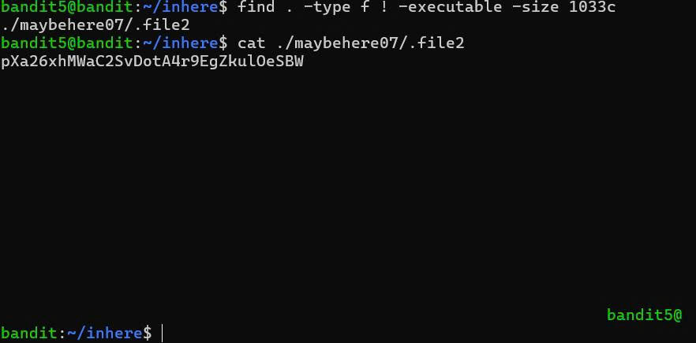

Mật khẩu của level tiếp theo là: pXa26xhMWaC2SvDotA4r9EgZkulOeSBW


#### Level 6 -> 7
Ở ```level 6 -> 7``` mình cần lấy được password ở một ```file ẩn``` được lưu trữ ở vị trí nào đó trong ```sever```. Đồng thời thỏa mãn các thuộc tính sau:

- own by user bandit7 (thuộc sở hữu của user bandit7).
- own by group bandit6 (thuộc sở hữu của gruop bandit6).
- 33 bytes in size (dung lượng là 33 bytes).

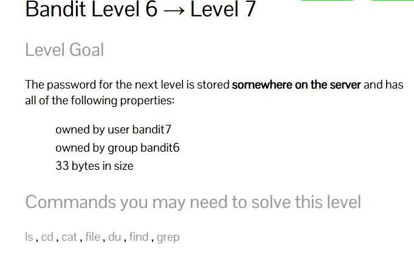


#### Solution 
Khi đã nắm rõ các cấu trúc lệnh ở level trên thì khi tìm password ở level này khá là dễ. Mình vẫn sẽ sử dụng lệnh ```find``` nhưng có một điều khác biệt là mình sẽ không sử dụng dấu ```.``` vì chỉ tim trong một thư mục nào đó, ở thử thách này thì các thư mục đã bị ẩn hết. Vì vậy ở đây mình sẻ sũ dụng dấu ```/``` để tìm các foler hay file ở toàn bộ hệ thống thông tin ```user```. Cụ thể ```find / -type f -user bandit7 -group bandit6 -size 33c```


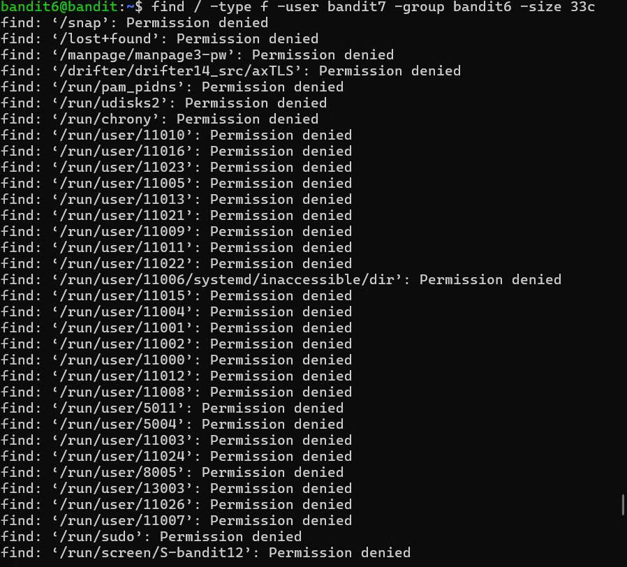

- Đến đây màn hình sẽ hiển thị một loạt các file mà lệnh ```find``` đã tìm được nhưng có rất nhiều các file không đủ quyền hạn(permission denied). Nếu bạn nào tinh mắt thì sẽ thấy ngay ```file``` chứa password.

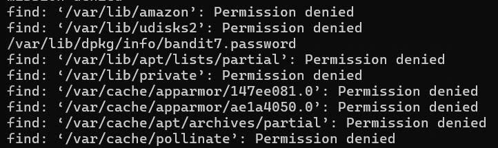

- ngoài ra mình có thẻ dùng lệnh để loại bỏ hết các file không thể truy cập(permission denied) bằng cách thêm lệnh ```2>/dev/null``` vào cuối câu lệnh. Cụ thể ```find / -type f -user bandit7 -gruop bandit6 -size 33c 2>/dev/null```

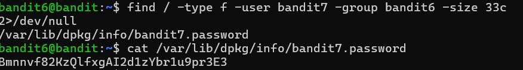

Mật khẩu cho level tiếp theo là: Bmnnvf82KzQlfxgAI2d1zYbr1u9pr3E3


#### Level 7 -> 8
Ở level này mật khẩu được giấu trong ```file data.txt```, kế bên là chữ ```millionth```.


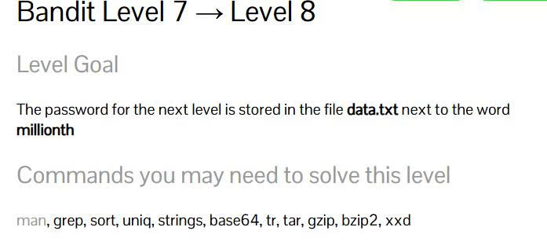

#### Solution 

Các lệnh cơ bản để có thể giải quyết thử thách này nhanh chóng:

- **man**: Để xem cách sử dụng về một lệnh nào đó.
- **grep**: Tìm kiếm một chuỗi kí tự hay một file nào.
- **sort**: Sắp xếp các chuỗi kí tự trong file hay một output.
- **uniq**: So sánh các chuỗi kí tự trong file hay một uotput nào đó.
- **strings**: Trích xuất các chuỗi kí tự có thể in được(printable characters) trong file nhị phân hay file nhị phân phức tạp.
- **base64**:  Mã hóa các chuỗi kí tự từ dãy nhị phân sang bảng ASCII text và dễ dàng truyền tải qua các giao thức mạng.
- **tr**: Dùng để dịch hoặc xóa kí tự.
- **tar**: Dùng để tạo quản lí và giải nén các tập tin đã lưu trữ.
- **gzip**: Dùng đẻ nén và giải nén các file theo định dạng gzip.
- **bzip**: Dùng đẻ nén và giải nén các file theo định dạng bzip.
- **xxd**: Chuyển dữ liệu dãy nhị phân sang mã hex(hệ thập lục phân)


Thử thách ở level này khá dễ nếu mình đi đúng hướng. Đầu tiên mình dùng lệnh ```ls -la``` để kiểm tra các ```file và folder```, thi thấy xuất hiện file ```data.txt```. Sau đó mình dùng lệnh ```cat``` để đọc file ```data.txt```.

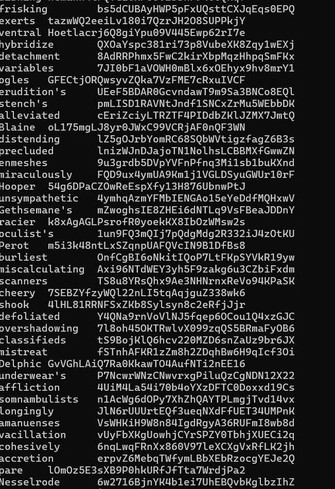

Đến đây nếu mình ngồi dò từng dòng ```output```xem dòng nào có chữ ```millionth``` thì có vẻ sẽ khá khoai. Nên đến đây mình sẽ dùng lệnh ```grep``` để tìm đúng dòng chứa mật khẩu đồng thời chứa cả chữ ```millionth```. Cụ thể ```grep  "millionth" data.txt```.

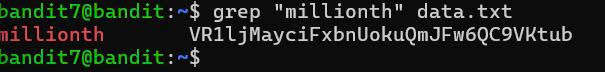

Mật khẩu cho level tiếp theo:  VR1ljMayciFxbnUokuQmJFw6QC9VKtub


#### Level 8 -> 9
Ở ```level 8 -> 9``` mật khẩu được lưu trữ trong ```file data.txt```, chỉ duy nhất một dòng không lặp lại trong file ```data.txt```.

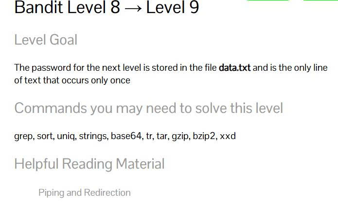

#### Solution
Ở level này , mình làm quen với lệnh mới là ```sort```. với Lệnh ```sort ``` (lưu ý dùng lệnh ```sort``` không kèm theo các ```[option]```) thì ```output``` sẽ sắp xếp các file theo thứ tự ```bảng chữ cái``` hay theo bảng mã ``ASCII text```.

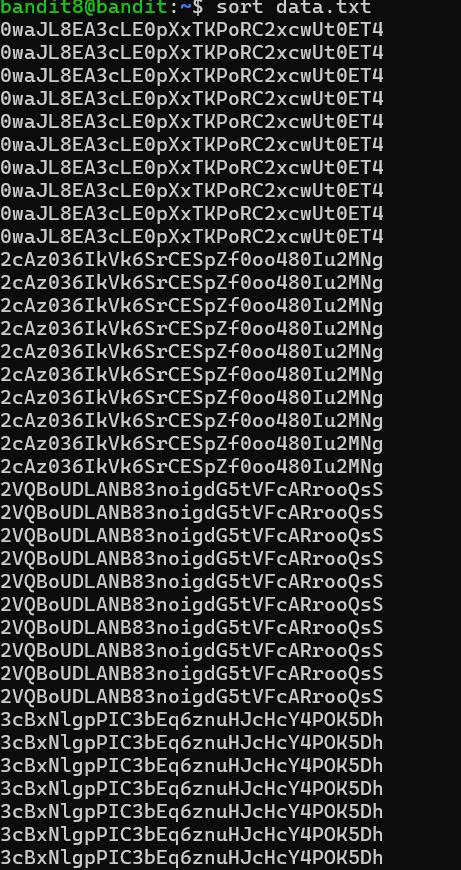

- Sau đó mìn kết hợp dùng lệnh ```uniq``` để loại bỏ các file lặp lại(lưu ý: lệnh ```uniq``` chỉ loại các file lặp liền kề do đó mình phải dùng kết hợp với lệnh ```sort``` qua dấu ```|```). Cụ thể ```sort data.txt | uniq -u```(```-u``` là kiểm tra các dòng xuất hiện đúng một lần).

  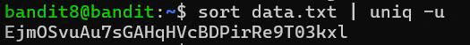

  Mật khẩu cho level tiếp theo là: EjmOSvuAu7sGAHqHVcBDPirRe9T03kxl

  #### level 9 -> 10

Ở cấp độ tiếp theo mật khẩu được đặt trong ```data.txt```. là một số ít chuỗi kí tự có thể đọc được, được đặt trước nhiều dấu ```=```.


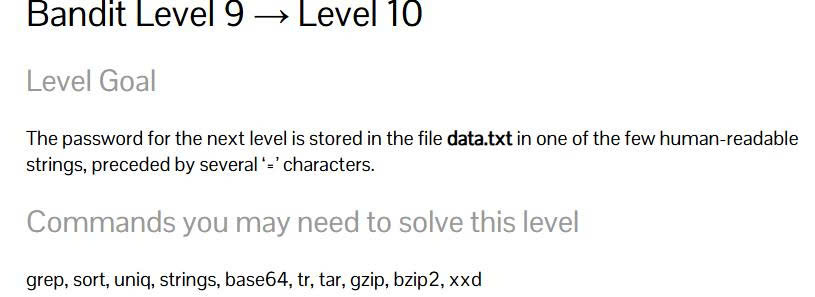

#### Solution 

Ở thử thách này, mình thấy khá dễ. Mình dùng lệnh ```strings``` kết hợp với ```grep```. Cụ thể ```strings data.txt | grep =```.

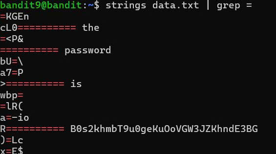

Mật khẩu của level tiếp theo là: B0s2khmbT9u0geKuOoVGW3JZKhndE3BG


#### Level 10 -> 11
Ở ```level 10 -> 11``` yêu cầu lấy password trong file ```data.txt``` , đồng thời chứa dữ liệu mã hóa `base64```.


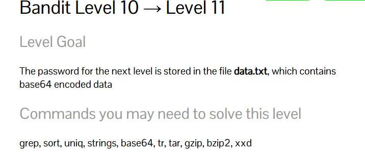

#### Solution 
Ngay từ đề bài ta đã biết password trong file ```data.txt``` đã bị mã hóa ```base64```. Nên mình dùng lệnh ```base64``` và thêm vào đó ```option -d(decode)```. Cụ thể ```base64 -d  data.txt```


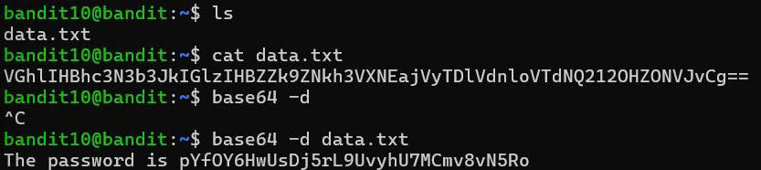

#### References
- [Base64 on Wikipedia ](https://en.wikipedia.org/wiki/Base64)

#### Level 11 -> 12
Ở thử thách này, password mình cần tìm nằm trong file ```data.txt``` được mã hóa một cách đặt biệt bằng cách các chữ cái thường ```a-z``` các chữ cái in hoa ```A-Z``` được thay đổi cách nhau 13 vị trí.

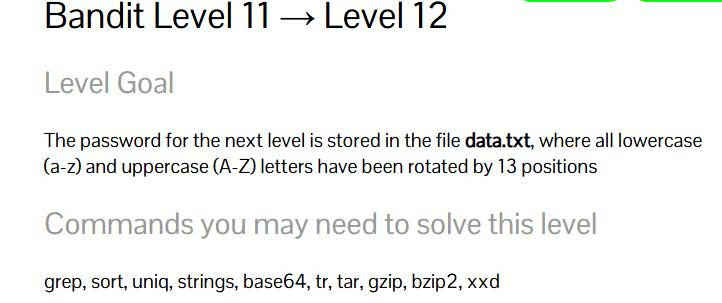


#### Solution
Khi đọc đề mình thấy password nằm trong file ```data.txt``` bị thay thế vị trí nên mình sử dụng lệnh ```tr``` để đổi lại vị trí của các kí tự. Mặt khác khi dùng lệnh ```tr``` thì ta phải dùng kết hợp với dấu pipe ```|``` vì lệnh ```tr``` không đọc file một cách trực tiếp. Cụ thể ```cat data.txt | tr 'a-zA-Z' 'n-za-mN-ZA-M'```

--> giải thích một chút ở lệnh ```'a-zA-Z' 'n-za-mN-ZA-M'```. Trên đề bài ta đã có các vị trí của các kí tự trong file ```data.txt``` đã bị thay đổi cách nhau 13 vị trí, xét theo hệ bảng chữ cái tiếng anh thì ta có chữ ```A``` cách chữ ```M``` đúng 13 vị trí và chữ ```N``` cách chữ ```Z``` cũng đúng 13 vị trí(bao gồm cả chữ in thường), nên ở đây mình cần đổi lại vị trí của các kí tự từ ```a-z và A-Z```thành các chuỗi kí tự cách nhau 13 vị trí ```n-z và a-m, N-Z và A-M```
  
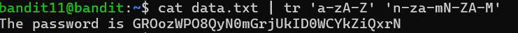

#### References

- [ROT13 on Wikipedia ](https://en.wikipedia.org/wiki/ROT13)
  


  


