# overthewire-solutions
Overthewire - writeups CTF
- **challenge**: bandit overthewire level 1->34
- **category**: basic linux
- **Difficulty**: easy
- **source** : [bandit overthewire](https://overthewire.org/wargames/bandit/)

**Note**: Đây là ```write up``` đầu tiên của mình trên hành trình ```ctf``` đặc biệt là ```puwable```. Trong bài viết này mình sẽ chia sẽ về con đường chinh phục 34 level của ```command linux``` trên ```bandit overthewire```.Các game của bandit là các thử thách cơ bản về các câu lệnh basic  linux giúp chúng ta có một cái nhìn khách quan về ```CTF```. Vì đây là bài viết đầu tiên của mình nên có gì sai sót mong mọi người góp ý.  

## level 0
Ở level 0 đề yêu cầu mình sữu dụng ```SSH``` .Máy chủ mà mình phải kết nối là ```bandit.labs.overthewire.org```, trên cổng ```2220``` .Tên đăng nhập và mật khẩu là ```bandit0```.


#### Solution
Để kết nối vào sever với cổng 2220, ta cần thêm option ```-p 2220``` (-p nghĩa là port) , ngoài ra ở cuối câu lệnh ta có thể sữ dụng thêm  option ```-l bandit0``` (-l nghĩa là login)


Lệnh input terminal: ```SSH bandit.labs.overthewire.org -p 2220 -l bandit0``` 
                                    hoặc  
                      ``` SSH bandit0@bandit.labs.overthewire.org -p2220```


Sau khi nhập input thì màn hình sẽ hiện ra yêu cầu nhập password và khi đó ta cần nhập mật khẩu  ```bandit0``` là sẽ vào được sever.


#### References
- [Secure shell(SSH) on wikipedia](https://en.wikipedia.org/wiki/Secure_Shell).
- [How to use SSH with a non-standard port on It's FOSS](https://itsfoss.com/ssh-to-port/).
- [How to use SSH with ssh-keys on wikiHow](https://www.wikihow.com/Use-SSH)

#### Level 0->1
Ở ```level 0->1 ``` mình cần tìm password trong thư mục tên là ```readme``` nằm trong thư mục chính. Sử dụng mật khẩu mới lấy được để đăng nhập vào ```bandit1``` bằng ```SSH```. Bất cứ khi nào bạn lấy được mật khẩu cho một cấp độ, sử dụng ```SSH``` trên ```port 2220``` để đăng nhập và tiếp tục game.

 

#### Solution
Trước khi giải game này ta phải làm quen với một số lệnh cơ bản:
- ```ls```:cho biết có bao nhiêu file trong folder.
- ```cd ```:lệnh này đưa mình đến một folder cụ thể.
- ```cat```:lệnh này cho phép mình đọc nội dung trong thư mục.
- ```file```:lệnh này dùng để xem kiểu file.
- ```du``` :lệnh này dùng để xem dung lượng của file và folder.
- ```find```:lệnh này dùng để tìm một file hay một folder.

Với các lệnh ở trên, ta sủ dụng lệnh ```ls``` để xem có bao nhiêu thư mục thì bất ngờ thư mục``` readme ``` hiện ra màn hình. Đến đây thì ta chỉ cần sử dụng lệnh ```cat``` để đọc thư mục ```readme```, và mật khẩu của level này hiện trong thư mục readme là :  ```6y2kwnwK6grgvwvpvLaa2T1cpFEKOhNR mk1 ```.

#### Level 1->2
Ở ```level 1->2 ``` mình cần tim password ở trong một thư mục có tên là ```-``` được lưu trữ trong thư mục chính.

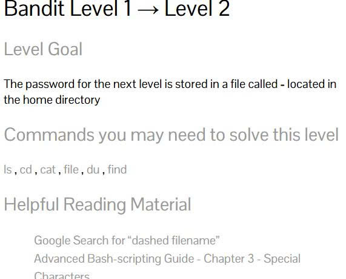

#### Solution 
Ở ```level 1->2```.Mình dùng lệnh ```cat``` để đọc thư muc ```-``` trong ```home directory```.Nhưng vấn đề đặt ra là tên thư mục là một dạng ``` dash filename ```, nên nếu ta dùng lệnh cat thông thường ```cat -``` thì nó sẽ hiểu một cách đăt biệt là đọc dữ liệu từ bàn phím ``` stdin ```.vậy để đọc được thư mục ```-``` bằng lệnh ```cat``` ta cần thêm vào địa chỉ của thư mục bằng cách thêm lệnh ``` ./ ```.Cụ thể ``` ./- ```

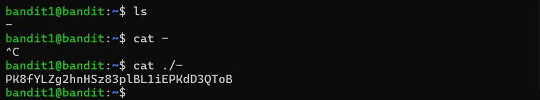
#### references
- [Google search for "dash filename".](https://www.google.com/search?q=dashed+filename).
- [Advanced Bash-ripting-chapter 3-Specical characters.  ](https://linux.die.net/abs-guide/special-chars.html)

##### Level 2->3
Ở ```level 2->3``` mình cần tìm password được lưu trữ trong một thư mục ```--spaces in this filename--``` được lưu trữ  ở thư mục chính.


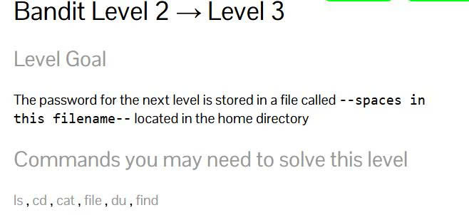


#### Solution
Như ở ```level``` trước nếu  thấy tên của một thư mục bắt đầu bằng ```-``` thì đó là một ```dash filename```.Do đó mình không thể nào dùng lệnh ```cat``` để đoc file ```--spaces in this filename--```, khi đó nó sẽ hiểu là một tùy chọn (-option) và màn hình sẽ hiển thị ra lỗi ```unexpected argument '--spaces' found``` nghĩa là lỗi tìm thấy đối số không mong muốn.

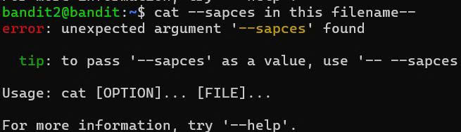


Để khắc phục lỗi như trên ta phải dùng một lệnh ```option``` đằng trước ```filename```.Cụ thể ```cat./"--spaces in this filename--"```

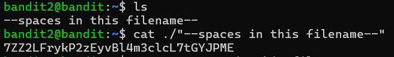

Ngoài ra vẫn còn thêm một hướng tiếp cận khác để đọc file ```--spaces in this filename--``` bằng cách thêm đường dẫn cụ thể ```\```.Cụ thể ```./--spaces\ in\ this\ filename--```

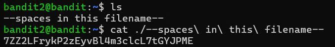

#### References
- [Google search for "spaces in filename"](https://www.google.com/search?q=spaces+in+filename).


#### Level 3 -> 4
Ở level này ```password``` nằm ở một ```file ẩn ``` trong thư mục ```inhere```.

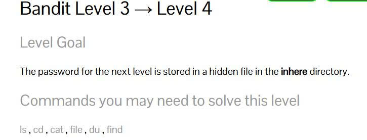

#### Solution 
Ở level này mình cần phải hiểu rằng ```inhere``` ở đây không phải là một file để ta có thể đọc bằng lệnh ```cat``` mà ```inhere``` là một thư mục chính (home directory). Vì thế nếu muốn lấy được mật khẩu ta cần phải di chuyển vào thư mục ```inhere``` bằng một lệnh quen thuộc ```cd```.Cụ thể ```cd inhere```.


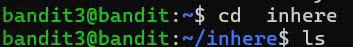


Nếu khi vào được thư mục ```inhere``` mà bạn vội vàng input lệnh ```ls``` thì xin chúc mừng bạn đã phạm sai lầm.Ở đây minh sẽ đăt ra một giả thuyết là thư mục nằm trong ```inhere``` có tên bắt đầu bằng ```.``` 
thì lệnh ```ls``` sẽ không thể nào  hiển thị ra được.

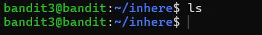

Nói về bản chất một tí. Lệnh ```ls``` chỉ liệt kê ra các lệnh mà tên không bắt đâu bằng ```.``` và khi xuất ra các file hay thư mục sẽ hiển thị theo bảng chữ cái. Khi này mình muốn đọc hết tất cả các file ẩn trong thư mục ```inhere``` ta sử dụng lệnh ```ls -la```.


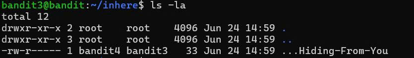

Đến đây ta đã thấy xuất hiện file ẩn ```...Hiding-From-You```. Và phần việc còn lại là dùng lệnh ```cat``` để đọc nội dung bên trong. Cụ thể ```cat ...Hiding-From-You```

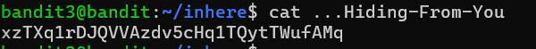
Mật khẩu cho level tiếp theo là: xzTXq1rDJQVVAzdv5cHq1TQytTWufAMq.


#### Level 4 -> 5
Level này yêu cầu mình lấy password được giấu trong ```file duy nhất  có thể đọc được``` được lưu trữ trong thư mục ```inhere```.

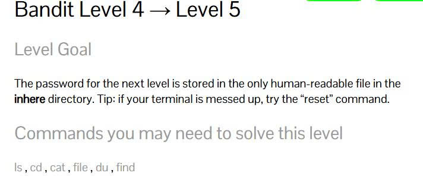

#### Solution
Như ở thử thách trước sau khi vào được ```user bandit4```, mình nhập lệnh ```ls``` để hiển thị các thư mục, thì thấy xuất hiện Folder ```inhere```. Dùng lệnh ```cd``` để đi vào thư mục ```inhere```, tiếp đến mình kiểm tra các thư mục con hay các file có trong thư mục này bằng lệnh ```ls```.Bất ngờ xuất hiện hàng loạt file nhỏ ```-file00->--file09```

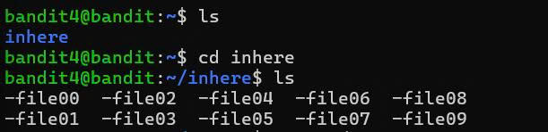

Đến đây mình sẽ cung cấp cho các bạn 3 hướng đi để có cái nhìn trực quan về cách đọc file như nào cho hiệu quả.

- Cách tiếp cận đầu tiên, ta có thể dùng lệnh ```cat``` cho từng file .Cụ thể ```cat ./-file00->09```.
- Cách tiếp cận thứ hai, ta có thể dùng lệnh ```file```.Cụ thể ```file ./*```.

  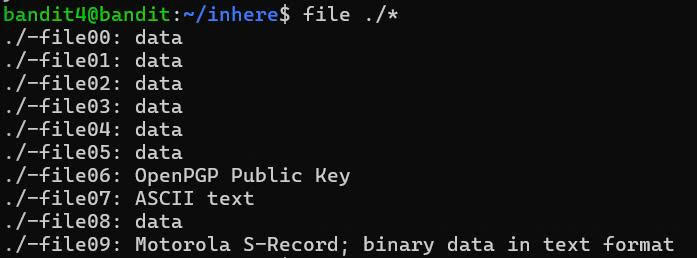

- Cách tiếp cận thứ ba, ta vẫn sẽ sử dụng lệnh ```file``` nhưng theo một cách tối ưu. Nếu dùng lệnh ```file``` như ở cách tiếp cận thứ hai thì bắt buộc mình phải đi vào thư mục ```inhere```. Vậy nếu không đi vào thư mục ```inhere``` thì có thể đọc được các file trong đó không? Thật vậy, mình chỉ cần thêm ```tên thư mục ```vào giữa ```./tên thư mục/*```.Cụ thể ```file ./inhere/*```.

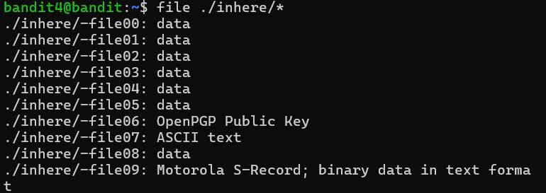

Đến đây ta có thể dễ dàng thấy được ```./inhere/-file07``` là nơi chứa password. Việc cuói cùng là dùng lệnh ```cat``` để đọc file. Cụ thể ```cat ./inhere/-file07```.

- Mật khẩu cho level tiếp theo là: 6C7h9GD8M6ai5nr7wo1RonrzFjj9yIrG.

#### Level 5-> 6
Đén ```level 5->6``` yêu cầu mình tìm password trong một ```file con``` nào đó trong thư mục ```inhere```. Đòng thời thỏa mãn các thuộc tính sau:

- Human-readable(có thể đọc được)
- 1033 bytes in size(có dung lượng là 1033 bytes)
- Not executable(không có khả năng thực thi)


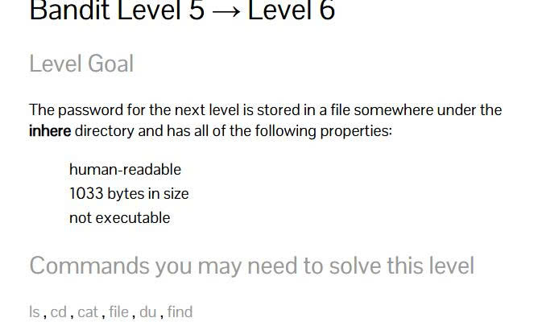


#### Solution


Ở level này nếu mình chỉ dùng lệnh ```ls``` để xem hiển thị các thư mục, file sau đó dùng lệnh ```cd``` đi vào các thư mục để tìm password thì sẽ rất lâu. Vì khi với đi vào thư mục ```inhere```, lệnh ```ls``` làm hiển thị thư mục ```maybehere00 -> maybehere19```, trong từng thư mục đó có thêm rất nhiều các ```file nhỏ``` khác nữa. Nên việc tìm mật khẩu bằng cách này là bất khả thi.

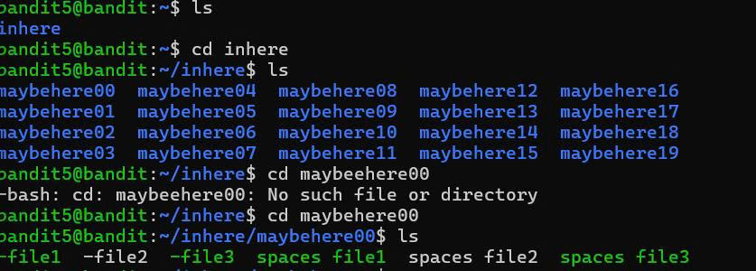

Dựa vào các điều kiện của đề. Mình sẽ suy nghĩ về việc sử dụng lệnh tối ưu hơn, có thể xem định dạng các file, tìm kiếm nhanh chóng:

- **Theo điều kiện đầu tiên**. ```File``` chứa password có thể đọc được (human-readable). Từ đó, mình sẽ sử dụng lệnh ```file``` kết hợp với lệnh ```grep``` để lọc lại các file mình có thể đọc theo```ASCII text```. Cụ thể ```file */* | grep "ASCII text"``` (```*/*``` trong lệnh input được xem là một ```option``` giúp kiểm tra các file trong thư mục con)

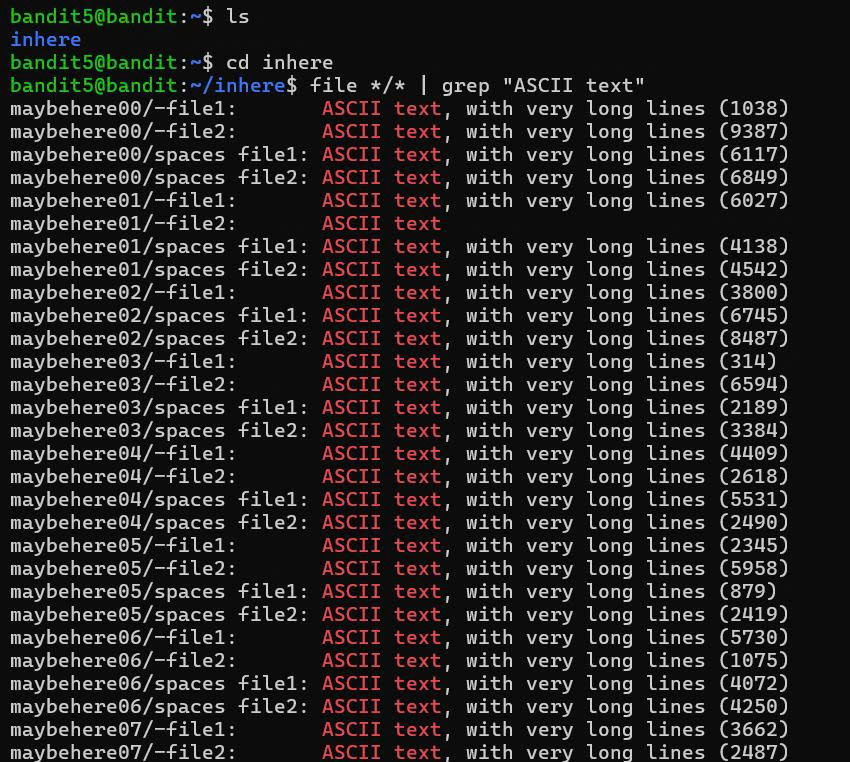


- **theo điều kiện thứ hai**. ```file``` chứa password có dung lượng là ```1033 bytes```. Mình dùng lệnh ```find ``` để tìm. Cụ thể ``` find . -type f -size 1033c```, ở đây chắc nhiều người sẽ không hiểu tại sao lại dùng ```.``` và ```-type ``` là cái gì?

--> Khi đã đi vào thư mục ```inhere``` ta sử dụng dấu ```.``` để tìm các file hay thư mục con nằm trong thư mục ```inhere```. Lệnh ```-type f``` nghĩa là mình yêu cầu nó chỉ tìm các ```file``` bỏ qua các ```folder``` khác. Còn ```-size 1033c``` nghĩa là dung lương 1033 bytes.


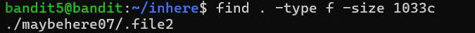

-**theo điều kiện cuối**. ```file``` chứa password không có khả năng thực thi nghĩa là một ```file``` mà user không cho phép chạy như một chương trình. Mình vẫn sẽ sử dụng lệnh ```find``` để tìm. Cụ thể ```find . -type ! -executable```(```! - excutable``` là không thể thực thi).


Đến đây để tinh gọn cho các dòng input. Mình sử gộp các điều kiện trên trong 1 dòng. Cụ thể ```find . -type f ! -executable -size 1033c```.

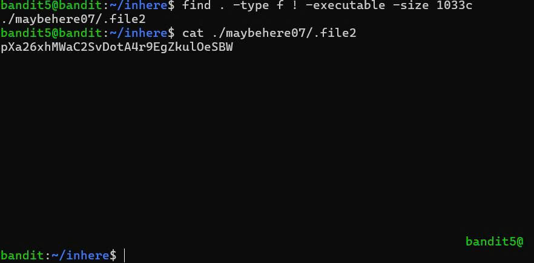

Mật khẩu của level tiếp theo là: pXa26xhMWaC2SvDotA4r9EgZkulOeSBW


#### Level 6 -> 7
Ở ```level 6 -> 7``` mình cần lấy được password ở một ```file ẩn``` được lưu trữ ở vị trí nào đó trong ```sever```. Đồng thời thỏa mãn các thuộc tính sau:

- own by user bandit7 (thuộc sở hữu của user bandit7).
- own by group bandit6 (thuộc sở hữu của gruop bandit6).
- 33 bytes in size (dung lượng là 33 bytes).

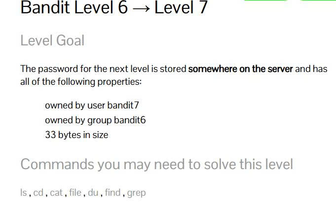


#### Solution 
Khi đã nắm rõ các cấu trúc lệnh ở level trên thì khi tìm password ở level này khá là dễ. Mình vẫn sẽ sử dụng lệnh ```find``` nhưng có một điều khác biệt là mình sẽ không sử dụng dấu ```.``` vì chỉ tim trong một thư mục nào đó, ở thử thách này thì các thư mục đã bị ẩn hết. Vì vậy ở đây mình sẻ sũ dụng dấu ```/``` để tìm các foler hay file ở toàn bộ hệ thống thông tin ```user```. Cụ thể ```find / -type f -user bandit7 -group bandit6 -size 33c```


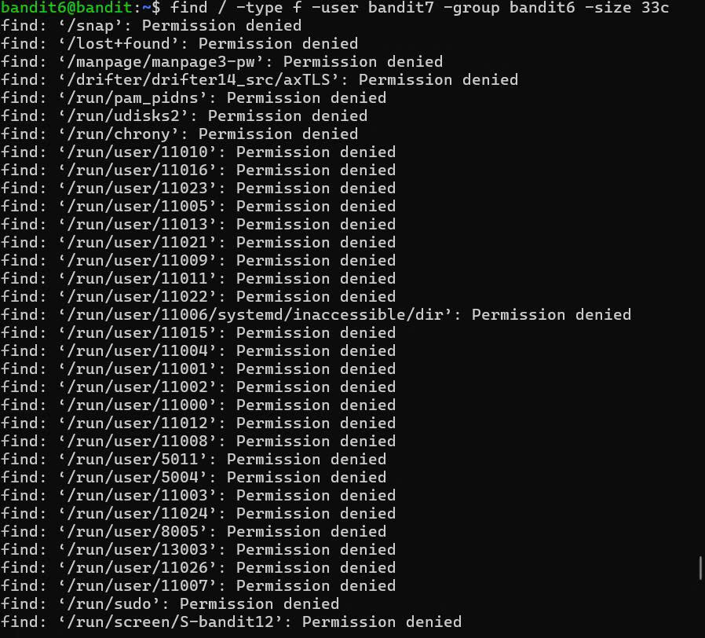

- Đến đây màn hình sẽ hiển thị một loạt các file mà lệnh ```find``` đã tìm được nhưng có rất nhiều các file không đủ quyền hạn(permission denied). Nếu bạn nào tinh mắt thì sẽ thấy ngay ```file``` chứa password.

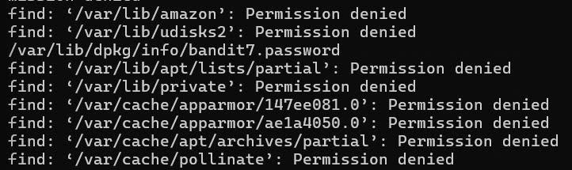

- ngoài ra mình có thẻ dùng lệnh để loại bỏ hết các file không thể truy cập(permission denied) bằng cách thêm lệnh ```2>/dev/null``` vào cuối câu lệnh. Cụ thể ```find / -type f -user bandit7 -gruop bandit6 -size 33c 2>/dev/null```

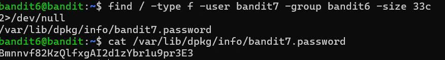

Mật khẩu cho level tiếp theo là: Bmnnvf82KzQlfxgAI2d1zYbr1u9pr3E3


#### Level 7 -> 8
Ở level này mật khẩu được giấu trong ```file data.txt```, kế bên là chữ ```millionth```.


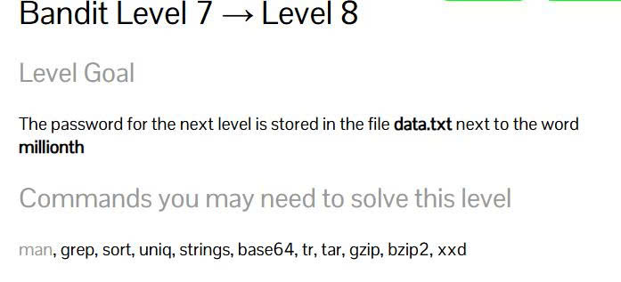

#### Solution 

Các lệnh cơ bản để có thể giải quyết thử thách này nhanh chóng:

- **man**: Để xem cách sử dụng về một lệnh nào đó.
- **grep**: Tìm kiếm một chuỗi kí tự hay một file nào.
- **sort**: Sắp xếp các chuỗi kí tự trong file hay một output.
- **uniq**: So sánh các chuỗi kí tự trong file hay một uotput nào đó.
- **strings**: Trích xuất các chuỗi kí tự có thể in được(printable characters) trong file nhị phân hay file nhị phân phức tạp.
- **base64**:  Mã hóa các chuỗi kí tự từ dãy nhị phân sang bảng ASCII text và dễ dàng truyền tải qua các giao thức mạng.
- **tr**: Dùng để dịch hoặc xóa kí tự.
- **tar**: Dùng để tạo quản lí và giải nén các tập tin đã lưu trữ.
- **gzip**: Dùng đẻ nén và giải nén các file theo định dạng gzip.
- **bzip**: Dùng đẻ nén và giải nén các file theo định dạng bzip.
- **xxd**: Chuyển dữ liệu dãy nhị phân sang mã hex(hệ thập lục phân)


Thử thách ở level này khá dễ nếu mình đi đúng hướng. Đầu tiên mình dùng lệnh ```ls -la``` để kiểm tra các ```file và folder```, thi thấy xuất hiện file ```data.txt```. Sau đó mình dùng lệnh ```cat``` để đọc file ```data.txt```.

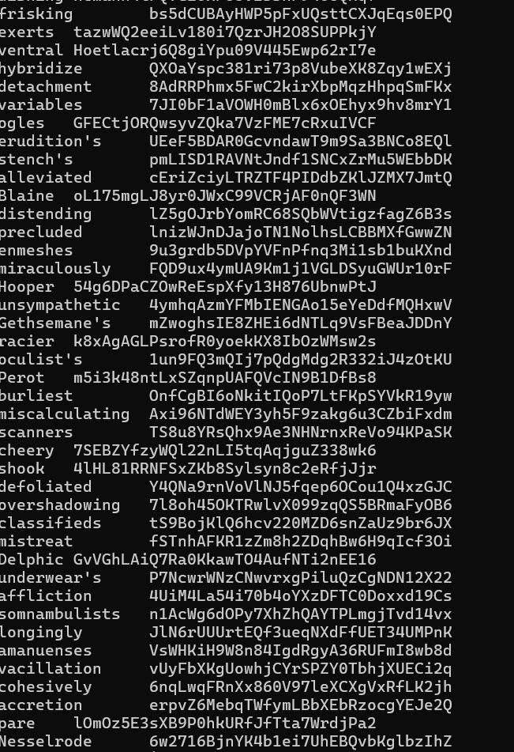

Đến đây nếu mình ngồi dò từng dòng ```output```xem dòng nào có chữ ```millionth``` thì có vẻ sẽ khá khoai. Nên đến đây mình sẽ dùng lệnh ```grep``` để tìm đúng dòng chứa mật khẩu đồng thời chứa cả chữ ```millionth```. Cụ thể ```grep  "millionth" data.txt```.

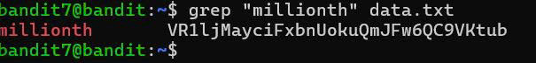

Mật khẩu cho level tiếp theo:  VR1ljMayciFxbnUokuQmJFw6QC9VKtub


#### Level 8 -> 9
Ở ```level 8 -> 9``` mật khẩu được lưu trữ trong ```file data.txt```, chỉ duy nhất một dòng không lặp lại trong file ```data.txt```.

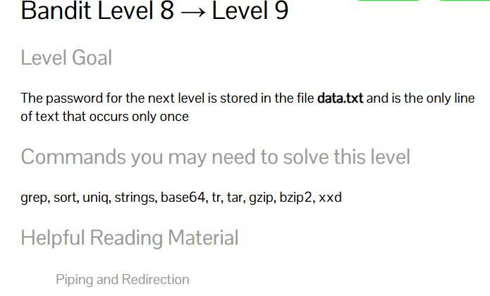

#### Solution
Ở level này , mình làm quen với lệnh mới là ```sort```. với Lệnh ```sort ``` (lưu ý dùng lệnh ```sort``` không kèm theo các ```[option]```) thì ```output``` sẽ sắp xếp các file theo thứ tự ```bảng chữ cái``` hay theo bảng mã ``ASCII text```.

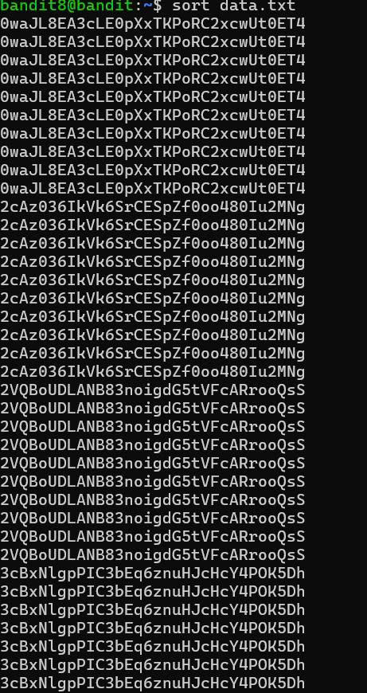

- Sau đó mìn kết hợp dùng lệnh ```uniq``` để loại bỏ các file lặp lại(lưu ý: lệnh ```uniq``` chỉ loại các file lặp liền kề do đó mình phải dùng kết hợp với lệnh ```sort``` qua dấu ```|```). Cụ thể ```sort data.txt | uniq -u```(```-u``` là kiểm tra các dòng xuất hiện đúng một lần).

  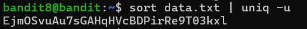

  Mật khẩu cho level tiếp theo là: EjmOSvuAu7sGAHqHVcBDPirRe9T03kxl

  #### level 9 -> 10

Ở cấp độ tiếp theo mật khẩu được đặt trong ```data.txt```. là một số ít chuỗi kí tự có thể đọc được, được đặt trước nhiều dấu ```=```.


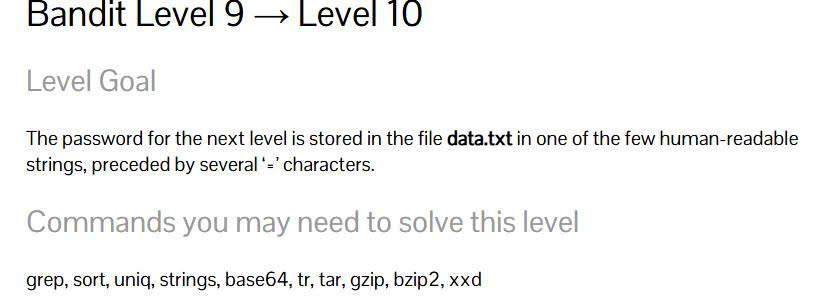

#### Solution 

Ở thử thách này, mình thấy khá dễ. Mình dùng lệnh ```strings``` kết hợp với ```grep```. Cụ thể ```strings data.txt | grep =```.

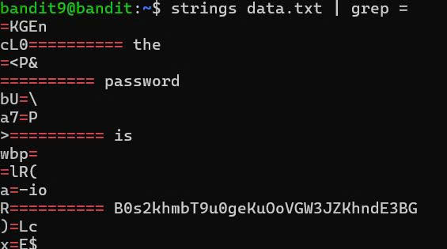

Mật khẩu của level tiếp theo là: B0s2khmbT9u0geKuOoVGW3JZKhndE3BG


#### Level 10 -> 11
Ở ```level 10 -> 11``` yêu cầu lấy password trong file ```data.txt``` , đồng thời chứa dữ liệu mã hóa `base64```.


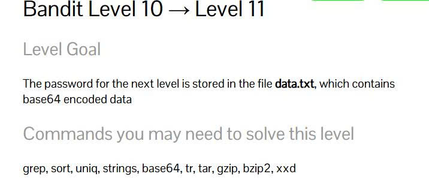

#### Solution 
Ngay từ đề bài ta đã biết password trong file ```data.txt``` đã bị mã hóa ```base64```. Nên mình dùng lệnh ```base64``` và thêm vào đó ```option -d(decode)```. Cụ thể ```base64 -d  data.txt```


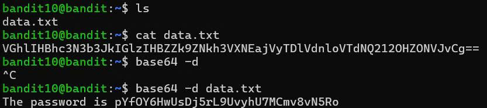

#### References
- [Base64 on Wikipedia ](https://en.wikipedia.org/wiki/Base64)

#### Level 11 -> 12
Ở thử thách này, password mình cần tìm nằm trong file ```data.txt``` được mã hóa một cách đặt biệt bằng cách các chữ cái thường ```a-z``` các chữ cái in hoa ```A-Z``` được thay đổi cách nhau 13 vị trí.

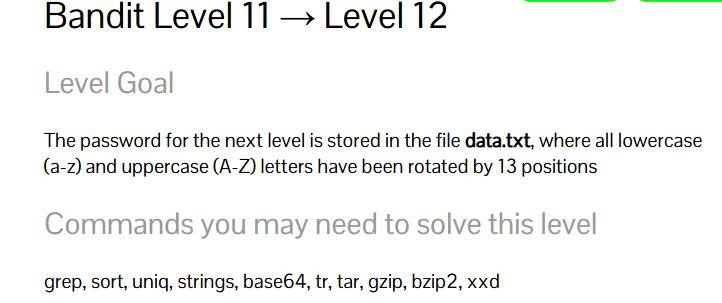


#### Solution
Khi đọc đề mình thấy password nằm trong file ```data.txt``` bị thay thế vị trí nên mình sử dụng lệnh ```tr``` để đổi lại vị trí của các kí tự. Mặt khác khi dùng lệnh ```tr``` thì ta phải dùng kết hợp với dấu pipe ```|``` vì lệnh ```tr``` không đọc file một cách trực tiếp. Cụ thể ```cat data.txt | tr 'a-zA-Z' 'n-za-mN-ZA-M'```

--> giải thích một chút ở lệnh ```'a-zA-Z' 'n-za-mN-ZA-M'```. Trên đề bài ta đã có các vị trí của các kí tự trong file ```data.txt``` đã bị thay đổi cách nhau 13 vị trí, xét theo hệ bảng chữ cái tiếng anh thì ta có chữ ```A``` cách chữ ```M``` đúng 13 vị trí và chữ ```N``` cách chữ ```Z``` cũng đúng 13 vị trí(bao gồm cả chữ in thường), nên ở đây mình cần đổi lại vị trí của các kí tự từ ```a-z và A-Z```thành các chuỗi kí tự cách nhau 13 vị trí ```n-z và a-m, N-Z và A-M```
  
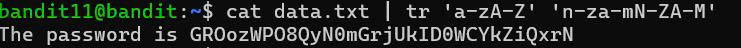
Mật khẩu cho level tiếp theo là: GROozWPO8QyN0mGrjUkID0WCYkZiQxrN

#### References


- [ROT13 on Wikipedia ](https://en.wikipedia.org/wiki/ROT13)


#### Level 12 -> 13

Ở level này password được giấu trong  có tên là ```data.txt```, được định dạng sẵn là một ```hexdump``` và đã được nén nhiều lần. Và đề có cho mình một gợi tí là hãy tạo một thư mục mới dưới dạng ```/tmp```. Nơi mà mình có thể giải né các file ```hexdump```, dùng lệnh ```mktemp -d``` để tạo một ```directory ``` và copy các dữ liệu trong tệp ```data.txt``` qua thư mục mới tạo bằng lệnh ```cp``` đồng thơi thực hiện thao tác đổi tên bằng lệnh ```mv```.


#### Solution
 Ở đây nếu dùng lệnh ```cat``` để đọc tệp ```data.txt``` thì sẽ xuất ra các dòng lệnh theo mã ```hex``` mình cần phải dịch ngược các dòng lệnh đó để tạo ra mật khẩu.


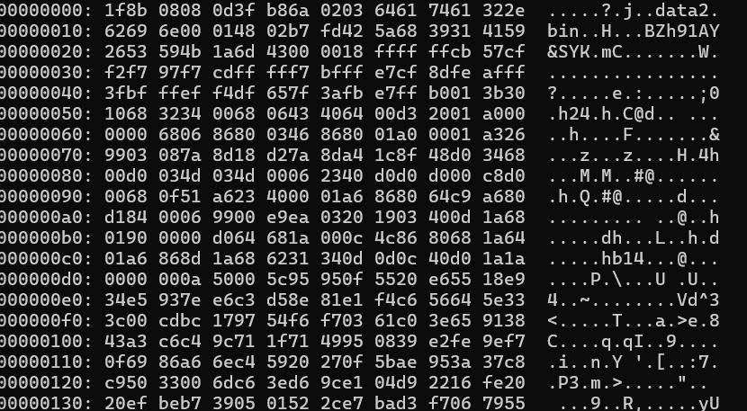

Khỉ tiếp cận vào bài này mình sẽ nghĩ là sử dụng lệnh ```xxd``` để giải nén tệp ```data.txt```. nhưng kết quả xuất ra màn hình là các kí tự lạ. Ở đây mình có thể giải thích về các kí tự là này như sau: vì mình dùng lệnh ```xxd -r data.txt```(option -r có nghĩa là reverse ) mà không điều hướng đầu ra thì kết quả output là các kí tự lạ. 


Đến đây mình thử tạo một thư mục có đường dẫn là ```/tmp``` bằng lệnh ```mktemp -d```.
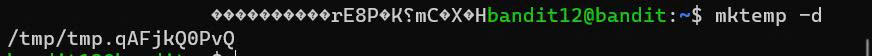

- Mình thấy một thư mục mới đã được tạo. Mình tiến hành đi vào tệp đó với lệnh ```cd```. Sau khi vào được tệp đó mình thực hiện thao tác copy các dữ liệu từ tệp ```data.txt``` bằng lệnh ```cp```. Cụ thể ```cp ~/data.txt .```. Sau đó mình dùng lệnh ```ls``` để kiểm tra xem trong thư mục mới tạo đã có tệp ```data.txt``` chưa.
- Tiếp đến mình sử dụng lại lệnh ```xxd -r data.txt ``` nhưng lần này mình sẽ truyền vào một đầu ra có tên là ```tintitun```. Cụ thể ```xxd -r data.txt > tintitun```. sau đó mình dùng lệnh ``` file``` để kiểm tra xem đầu ra của tệp ```data.txt``` là gì. Cụ thể dùng lệnh ```file tintitun```.

  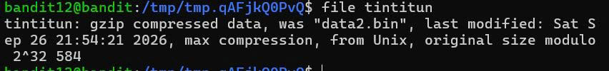

- Khi đó mình nhận ra ngay đó là định dạng gzip. thể giải nén tệp gzip như thế nào? Như trên đề có gợi ý mình phải đổi tên bằng lệnh ``` mv```(lưu ý: đổi tên nhưng phải có đuôi ```.gz``` thì mới có thể giải nén các thư mục định dạng gzip được), sau đó giải nén bằng lệnh ```gzip -d ```.

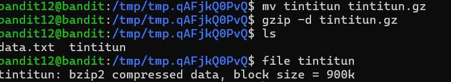

-Mình thấy sau khi giải nén định dạng dầu ra ```tintitun``` thì định dạng ```bzip2``` xuất hiện nên mình thưc hiện lại các thao tác khi làm với ```gzip```. 


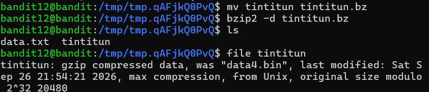

- Tiếp tục mình thấy định dạng đầu ra của nó lại là ```gzip``` như thay đổi địa chỉ lưu trữ từ ```data2.bin``` thành ```data4.bin```. Mình tiếp tục lặp lại các thao tác.


 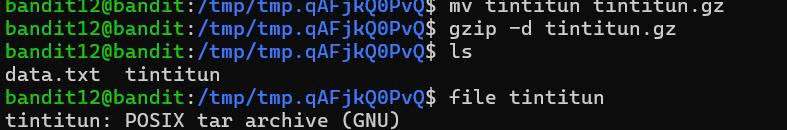

 - Tiếp theo mình thấy định dạng đầu ra của tệp ```data.txt``` đã bị thay đổi. Lần này là định dạng ```tar```. Mình dùng lệnh ```tar``` thêm option ```-xvf```(x là extract, v là verbose, f là file nghĩa là trích xuất chi tiết các file trong tệp). Cụ thể ```tar -xvf tintitun```

 - 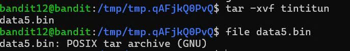

- Sau khi giải nén xong mình thấy xuất hiện file mới ```data5.bin``` nên mình dùng lệnh ```file``` để kiểm tra thì thấy lại là file ```tar```. Mình tiếp tục dùng lệnh ở trên để trích xuất dữ liệu trong file```data5.bin```

  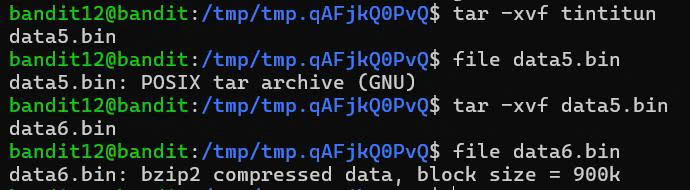

  - Xuất hiện lại định dạng ```bzip2```. Tiếp tục lặp lại thao tác giải nén tệp ```bzip2```
    
    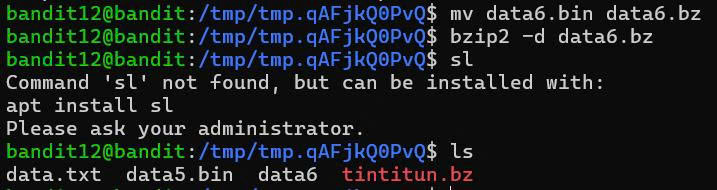

 - MÌnh kiểm tra một tệp mới bằng lệnh ```file```. Thì thấy xuất hiện dạng ```tar```. Nên mình thực hiện giải nén dạng ```tar```.
 
   


 - Tiếp đến mình lại thấy xuất hiện tệp ```data8.bin```. Nên mình kiểm tra và thấy đó là định dạng ```gzip```, tiến hành giải nén file ```gzip```

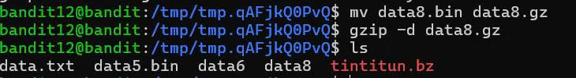


-Cuối cùng mình kiểm tra định dang file 8 thì thấy đó là một tệp ```ASCII text```, mình tiến hành đọc tệp ```data8``` bàng lệnh ```cat``` thì thấy xuất hiện passwword

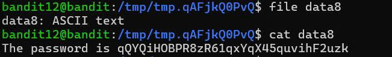

- Mật khẩu cho level tiếp theo là: qQYQiHOBPR8zR61qxYqX45quvihF2uzk


#### ferences
- [hexdump on Wikipedia ](https://en.wikipedia.org/wiki/Hex_dump)


#### Level 13 -> 14
Ở level này được lưu trong ```/etc/bandit_pass/bandit14``` và mình chỉ có thể đọc được khi mình đăng nhập vào ```user bandit14```. Ở đây mình sẽ không đi tìm password cho level này, mà mình phải tìm ```sshkey private```để có thể đăng nhập vào level tiếp theo. Nhìn vào việc đăng nhập vào các level trước đây để có thể đăng nhập vào```user``` thông qua giao thức```ssh``` và tìm cách sử dụng```key``` cho level tiếp theo. Và nếu bạn cần gợi ý thì có một tệp nằm ở trong thư mục chính, và hãy đọc kĩ các thông báo lỗi vì nó rất hữu ích.

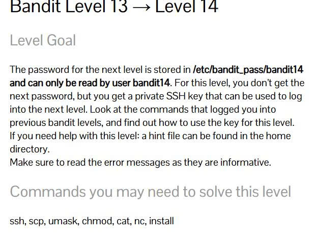

#### Solution 

Trước khi giải level này mình cần làm quen với các lệnh mới:
- **ssh**: là lệnh để đặng nhập vào máy chủ từ xa một cách an toàn.
- **scp**: là lệnh để copy nội dung của một thư mục hay một file để máy tính.
- **umask**:cho phép xem hoặc thiêt lập mặt nạ tạo tập tin.
- **chmod**: cho phép quyền truy cập vào file hay thư mục.
- **cn**: là một công cụ dòng lệnh cho phép gửi và nhận dữ liệu qua kết nối mạng sử dụng giao thức TCP hoặc UDP.
- **install**:cho phép sao chép file một cách linh hoạt.
- **telnet**:cho phép kết nối không bảo mật vào sever.

  
Khi đăng nhập vào ```bandit13``` và thực hiện các thao tác để đọc file ```sshkey.private```.

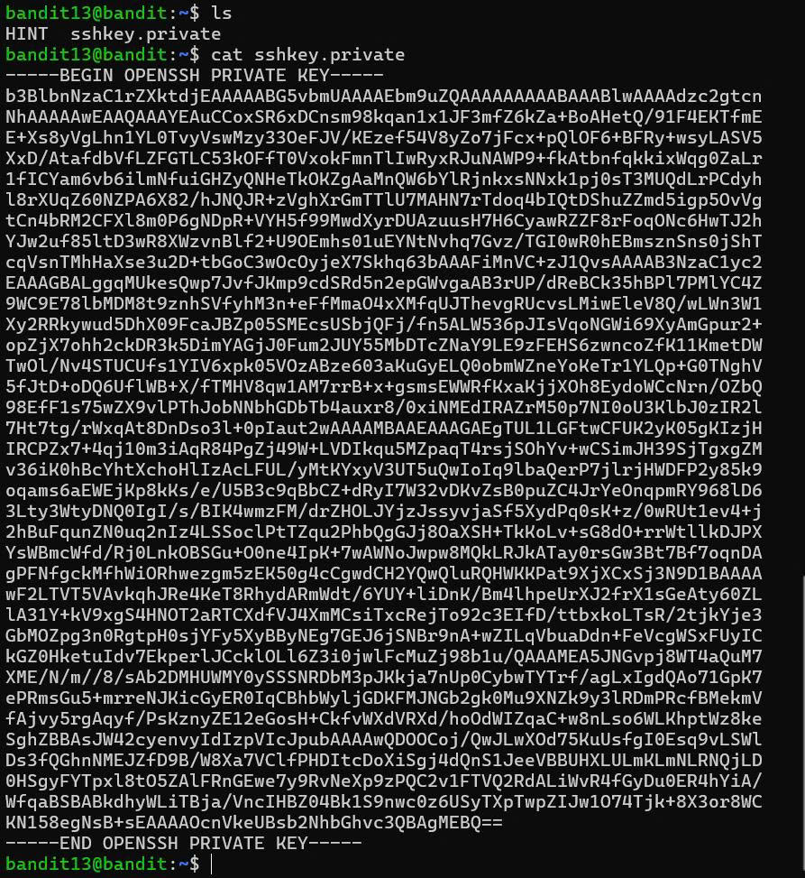

Nhưng vấn đề là mật khẩu không thể đọc được.Mà bắt buộc mình phải sử dụng ```sshkey.private``` để đăng nhập vào ```bandit14```. Một lưu ý là khi mình dùng terminal để giải thì không tồn tại cú pháp cho lệnh ```chmod```ngoài ra máy chủ đã khóa các truy cập từ cách lệnh đăng nhập bằng đường truyền ```ssh```. Nên ở level này mình sẻ sử dụng ```git bash```.

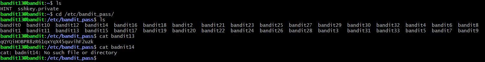

Sau khi mở ```git bash``` ta chuyển lại về ```terminal``` bằng lệnh ```cmd.exe```. Tiến hành đăng nhập vào ```bandit13```. Và nhận thấy một khóa ```sshkey.private```.Đến đây mình thực hiện thao tác để sao chép tệp ```sshkey.private``` bằng lệnh```scp```. 

Cụ thể ```scp -P bandit13@bandit.labs.overthewire.org:~/sshkey.private tintitun.private```(ở đây mình chép tẹp sshkey.private và mình truyền vào tệp tintitun.private)

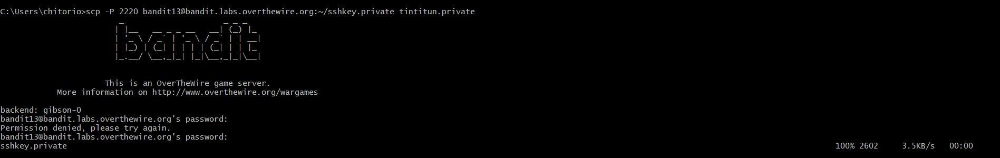

Để kiểm tra mình tạo được một tệp đầu ra của ```sshkey.private``` chưa? Mình dùng lệnh ```dir```.

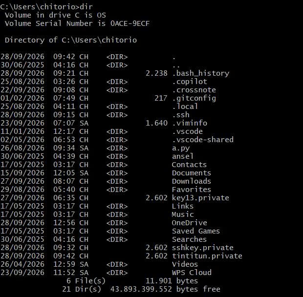

Khi thấy xuất hiện tệp đầu ra ```tintitun.private ```. Mình cần cung cấp quyền đọc và ghi bằng lệnh ```chmod```. Cụ thể ```chmod 600 tintitun.private```

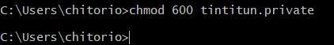

Đến đây mình truy cập vào máy chủ bằng lệnh đăng nhập nhưng mình dùng thêm một [option]```-i```(identity). Cụ thể ```ssh -p 2220 -i tintitun.private bandit14@bandit.labs.overthewire.org```.

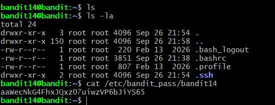

Đến đây mình sẽ dùng lệnh ```cat``` để đọc tệp ```/etc/bandit_pass/bandit14```

Mật khẩu cho level tiếp theo là: aaWecNkG4FhxJQxz07uiwzVP6bJiYS65

#### References
- [SSH/openSSH/Keys]( https://help.ubuntu.com/community/SSH/OpenSSH/Keys)
- [Tranferring File and SCP](https://help.ubuntu.com/community/SSH/TransferFiles)


#### Level 14->15
Ở level này, mình muốn có được mật khẩu của level tiếp theo thì phải truy cập vào user ```localhost``` ở cổng ```port 30000``` và gửi mật khẩu hiện tại lên.

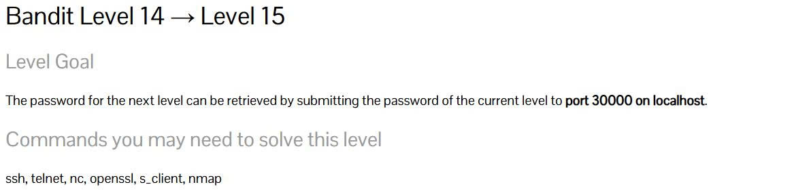

#### Solution
Để gửi và nhận một dữ liệu ở một đường dẫn cụ thể mình dùng lệnh ```nc```. Cụ thể ```nc localhost 30000```, hoặc mình có thẻ dùng lệnh ```telnet``` để gửi lại mật khẩu vào cổng ```30000```. Cụ thể ````telnet localhost 30000```.

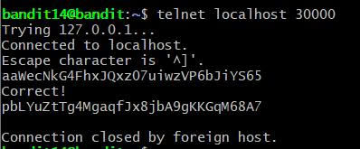

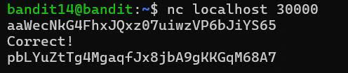

Mật khẩu cho level tiếp theo là: pbLYuZtTg4MgaqfJx8jbA9gKKGqM68A7

#### References
- [How the Internet works in 5 minutes (YouTube) (Not completely accurate, but good enough for beginners)](https://www.youtube.com/watch?v=7_LPdttKXPc)
- [IP Addresses](https://computer.howstuffworks.com/web-server5.htm)
- [IP Address on Wikipedia](https://en.wikipedia.org/wiki/IP_address)
- [Localhost on Wikipedia](https://en.wikipedia.org/wiki/Localhost)
- [Ports](https://computer.howstuffworks.com/web-server8.htm)
- [Port (computer networking) on Wikipedia](https://en.wikipedia.org/wiki/Port_(computer_networking))


#### Level 15->16
Màn cướp mật khẩu này ta phải gửi lại mật khẩu của level hiện tại lên ```localhost```vào cổng 30001. NHưng ta được cho giả thuyết là phải sử dụng ```SSL/TLS encryption```.

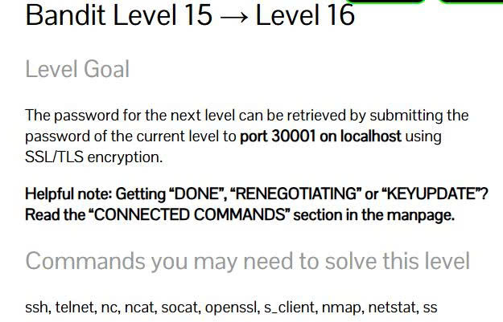

#### Solution
Để lấy được mật khẩu cho màn chơi tiếp theo, mình làm quen với các lệnh mới:
- **ncat**:Đọc/ghi dữ liệu qua cổng mạng bằng giao thức TCP hoặc UDP.
- **socat**:Chuyển tiếp dữ liệu hai chiều giữa hai luồng dữ liệu độc lập.
- **openssl**:Bộ công cụ mã hóa đa năng xử lý chứng chỉ số SSL/TLS, tạo khóa RSA/ECC, mã hóa/giải mã file và tính giá trị băm (hash).
- **s_client**:Đóng vai trò là một SSL/TLS Client để kết nối trực tiếp đến các dịch vụ đang chạy trên cổng có mã hóa SSL/TLS.
- **nmap**:Dò quét mạng và kiểm tra an ninh hệ thống.
- **netstat**:Hiển thị danh sách các kết nối mạng đang hoạt động, danh sách cổng đang lắng nghe ```listening ports```, bảng tuyến đường ```routing table``` trên máy hiện tại.
- **ss**:Chức năng tương tự ```netstat``` nhưng là phiên bản hiện đại hơn, cho tốc độ xử lý nhanh hơn và hiển thị chi tiết hơn thông tin về các socket mạng.
- **diff**: được dùng để nhận biết sự khác biệt giữa 2 thư mục.

Như ở trên đề, mình đã biết các dạng dữ liệu ở dạng ```SSl/TLS```, nên việc dùng ```netcat``` không được vì lệnh đó không đọc được dữ iệu ```SSL```. Vì thế mình dùng lệnh ```openssl```. Cụ thể ```openssl s_client -connect localhost:30001```. Sau đó mình điền password của level hiện tại vào.

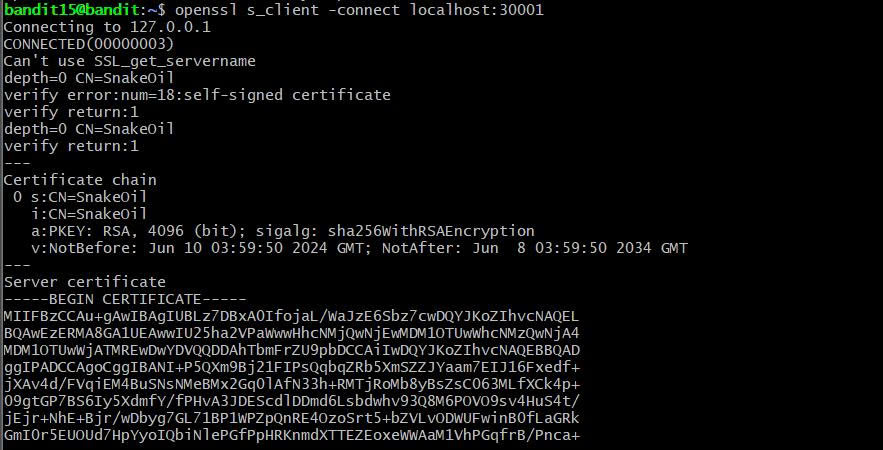


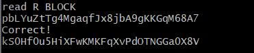

Mật khẩu cho level tiếp là: kS0Hf0u5HiXFwKMKFqXvPdOTNGGa0X8V


#### References
- [Secure Socket Layer/Transport Layer Security on Wikipedia](https://en.wikipedia.org/wiki/Transport_Layer_Security)
- [OpenSSL Cookbook - Testing with OpenSSL](https://www.feistyduck.com/library/openssl-cookbook/online/testing-with-openssl/index.html)


#### Level 16->17
Ở cấp độ này mình tìm mật khẩu cho level tiếp theo bằng cách gửi mật khẩu vào một cổng trong số các cổng từ ```31000 đến 32000``` trên ```localhost``` . Đầu tiên mình phải biết được cổng nào có chứa dữ liệu ```ssl``` cổng nào không. Sẽ có duy nhất một cổng có chứa mật khẩu, các cổng còn lại sẽ gửi lại các giá trị mà bạn đã gửi.

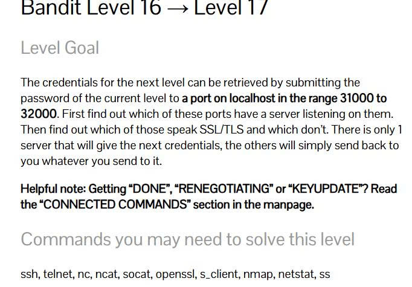

#### Solution
Khi đăng nhập vào ```bandit16``` ta tiến hành lọc các cổng nào có chứa ```password``` bằng lệnh ```nmap``` cùng với các ```option``` được kết hợp (```-Av```:aggressive verbose) hoặc option ```-sV```. Cụ thể ```nmap -Av -p 31000-32000 localhost```.

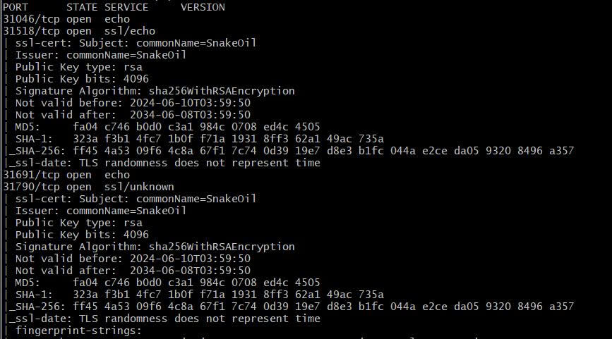

Mình thấy ngay cổng ```31790``` không trả về giá trị. Mình tiến hình dò cổng ```31790``` bằng lệnh ```openssl```. Cụ thể ``` openssl s_client -connect localhost:31790 -quiet```. Sau đó mình nhập mật khâu của level hiện tại vào để có được mật khẩu .

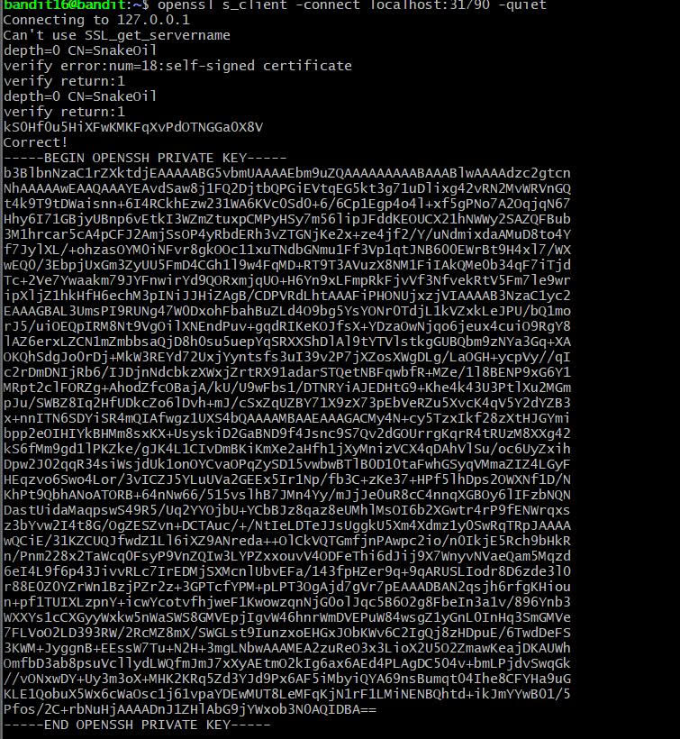

Nhưng đặc biệt ở đây dạng mật khẩu là khóa đặc biệt của ```SSH``` nên ở đây mình sẽ ăn gian 1 tí
=)) . Như ở các level trước mình đã tạo một tệp trong ```My documents``` có tên là ```sshkey.private```. Mình sẽ copy hết mật khẩu dạng đặc biệt của ```ssh``` cho vào tệp ```sshkey.private```, sau đó mình input lệnh ``` chmod 600 sshkey.private```. Tiếp đến mình đăng nhập vào ```bandit17``` bằng cách ```ssh -i sshkey.private -p 2220 bandit17@bandit.labs.overthewire.org```. Cuối cùng dùng lệnh ``` cat /etc/bandit_pass/bandit17``` để lấy mật khẩu.


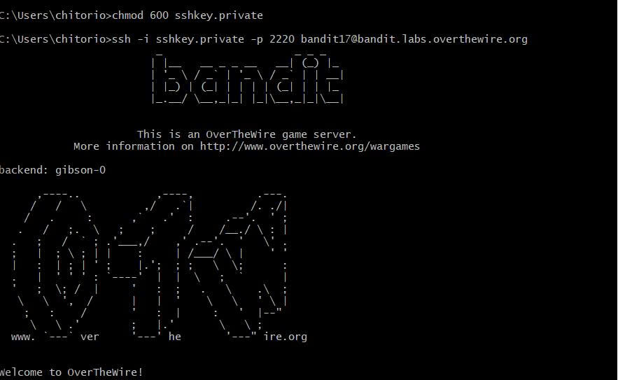

Mật khẩu cho level tiếp theo là: pWXMAZoxGC8JmDMfmT5MGEsobMM3vnj2

#### References
-[Port scanner on Wikipedia](https://en.wikipedia.org/wiki/Port_scanner)


#### Level 17->18
Ở level này mình có 2 thư mục nằm trong ```homedirectory```. Đó là ```passwords.old and passwords.new```. Mật khẩu cho level tiếp theo nằm trong thư mục ```passwords.new```. Là dòng duy nhất có thể thay đổi giữa ```passwords.old and passwords.new```.


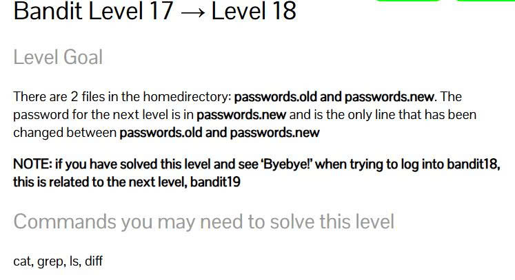


#### Solution 
ở đây mình dùng ```lệnh diff```. Cụ thể ```diff passwords.old passwords.new```.

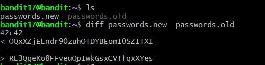

Mật khẩu cho level tiếp theo là: OQxXZjELndr90zuhOTDYBEomI0SZITXI


#### Level 18->19

Ở level này mật khẩu nằm trong file ```readme``` ở thư mục chính (```homedirectory```). Không may một số file ```bashrc``` đã bị chỉnh sửa khi mình đăng nhập vào bằng ```SSH```.

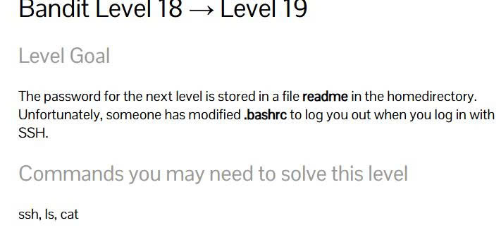

#### Solution
khi đăng nhập vào ```sever bandit18``` bằng mật khẩu mới lấy được, mình thấy xuất hiện một điều đặc biệt là nó sẽ không đi vào ```bandit18@bandit``` như thường.

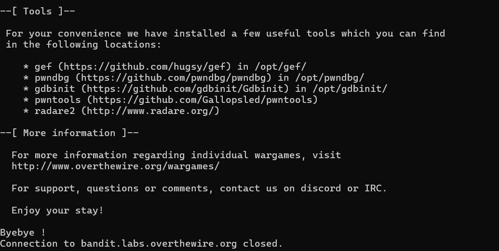

Đường dẫn bằng ```bashrc``` đã bị chỉnh sửa nên không thể đăng nhập vào user bằng ssh.

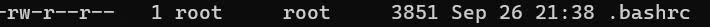

Nên ở đây mình sẽ sửa dụng thêm option(```-T```) có thể bỏ qua quá trình đọc file ```bashrc```. Cụ thể ```ssh bandit18@bandit.labs.overhthewire.org -p 2220 -T```. Sau đó mình dán mật khẩu của level hiện tại vào. Đến đây một hộp thoại ẩn hiện lên, tiếp theo mình cần tìm file ```readme``` bằng lệnh ```ls```, thì thấy file ```readme``` hiện ra và cuối cùng dùng lệnh ```cat``` để đọc file ```readme```.

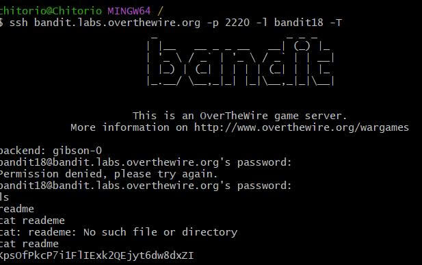

Mật khẩu cho level tiếp theo là: KpsOfPkcP7i1FlIExk2QEjyt6dw8dxZI

#### Level 19->20
Để truy cập lên cấp độ tiếp theo, bạn nên sử dụng nhị phân ```setuid``` trong thư mục chính. Thực thi nó mà không cần đối số để tìm hiểu cách để sử dụng nó. Mật khẩu cho cấp độ này có thể được tìm thấy trong phần thông thường ```Place (/etc/bandit_pass)```, sau khi bạn đã sử dụng nhị phân ```Setuid```.

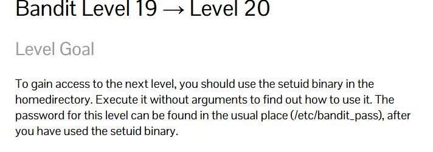

#### Solution
Khi log vào được sever ```bandit19```, mình thực hiện lệnh ```ls``` thấy xuất hiện file ```bandit20-do```. Ở đây mình đang muốn lấy được mật khẩu cho ```bandit20``` thì mình phải dùng lệnh```cat /etc/bandit_pass/bandit20``` nhưng output là ```permission denied``` có nghĩa là không có quyền truy cập. Nên ở đây mình sẽ đọc mật khẩu của bandit20 dưới quyền của user khác. Cụ thể ```./bandit20-do cat /etc/bandit_pass/bandit20```.


Mật khẩu cho level tiếp theo là: 4pIjcunZ0fK2vmp3IwfG8Vf7VhxD6pOA


#### Level 20->21
Ở level này, có một thư mục dạng ```setuid binary(nhị phân)``` nằm trong thư mục chính, mình phải sử dụng ```suconnect``` để làm theo các bước sau: đầu tiên mình phải tạo ra một cổng mới trên ```commandline``` để kết nối với ```localhost```, tiếp theo bạn sẽ nhập vào chương trình đang chạy ```suconnect``` dưới cổng mà mình mới tạo để ```suconnect``` tiến hành so sánh với mật khẩu của level hiện tại. Nếu đúng thì sẽ trả lại mật khẩu cho level tiếp theo.

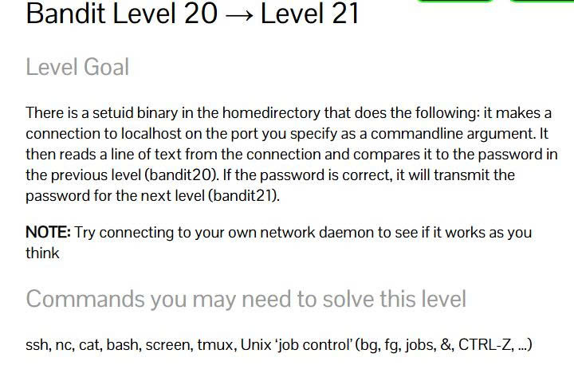

#### Solution 
Đầu tiên mình sẽ thực hiện thao tác tạo cổng mới để chạy ```suconnect``` và kết nối với ```localhost``` bằng lệnh ```netcat```. Cụ thể ```netcat -nlp 1810```(-n để bỏ qua kết nối DNS, -l để lắng nghe kết , -p chỉ định cổng khi lắng nghe kết nối).


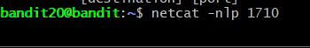

Sau đó mình cần kết nối với cổng mà mình mới tạo ra bằng cách mở một tab commandline, kết nối với ```bandit20``` sau đó chạy hệ nhị phân ```suconnect``` có kết nối với cổng mới tạo. Cụ thể ```./suconnect 1810```


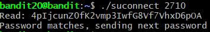

Sau khi chạy tệp nhị phân mình tiến hành điền mật khẩu vào để ```suconnect``` so sánh mới mật khẩu.


Mật khẩu cho level tiếp theo là: bW9kBv5WC3P4yoDyf12LSdGuNz5ka6hY

#### Level 21->22

Một chương trình chạy tự động theo các khoảng thời gian đều đặn từ cron, bộ lập lịch công việc dựa trên thời gian. Hãy tìm trong ```/etc/cron.d/``` cấu hình và xem lệnh nào đang được thực thi.

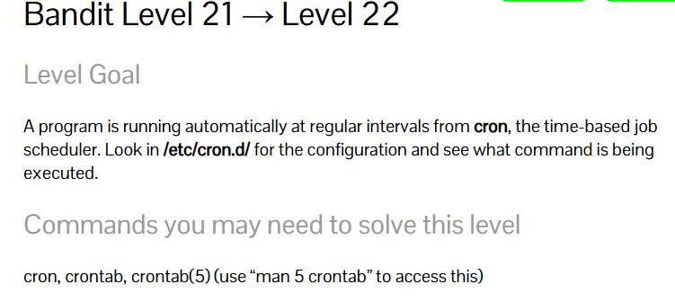

#### Solution
Đầu tiên mình phải đi vào ```/etc/cron.d/``` để tìm các tệp đang hoạt động bằng lệnh ```cd```. Sau đó mình sẽ thấy xuất hiện tệp ```cronjob_bandit22```xuất hiện, tiếp theo mình tiến hành đọc  tệp ```cronjob_badnit22```. Và mình thấy được 1 tệp ẩn ```bandit22 /usr/bin/cronjob_bandit22.sh```. Tiếp tục đọc tệp ẩn đó ta có một tệp mới ``` /tmp/t7O6lds9S0RqQh9aMcz6ShpAoZKF7fgv``` đã được cấp quyền đọc bới ```chmod``` và khi đọc tệp ấy mình có được mật khẩu.

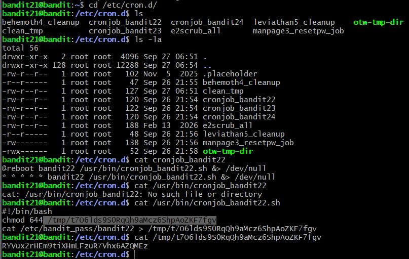

Mật khẩu cho level tiếp theo là: RYVux2rHEm9tiXHmLFzuR7Vhx6AZQMEz


  


